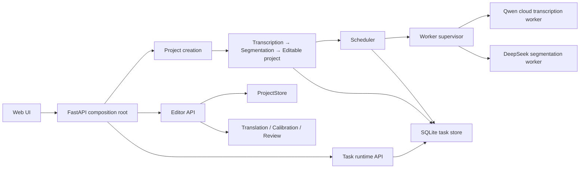

# Substar Beta module map

> This is the compact beta release overview. The current complete and executable authority is [`system-map.json`](system-map.json); use the generated [`system-map.md`](system-map.md) for module-level code, input/output, caller/consumer, recovery and test mappings.

| Boundary | Modules | Responsibility |
|---|---|---|
| Composition and instance ownership | `launcher.py`, `app.py`, `runtime_instance.py` | single instance, lifecycle, router composition |
| Project creation | `creation/`, project-creation routes in `app.py` | upload, idempotency, stable project identity, task graph |
| Task runtime | `runtime/model.py`, `store.py`, `scheduler.py`, `supervisor.py`, `worker_protocol.py` | state machine, events, resource arbitration, process ownership |
| Recognition | `recognition/registry.py`, `transcription/`, `qwen_cloud_asr.py` | immutable request, Qwen provider, word evidence, artifact validation |
| Segmentation input | `substar_core/segmentation/input_contract.py` | derive the unpunctuated canonical word timeline; raw ASR evidence remains immutable |
| Execution planning | `substar_core/segmentation/execution_planner.py` | choose approximately 180-second seams from time gaps, low volume and speaker changes; never use ASR punctuation or sentence flags |
| Semantic segmentation | `substar_core/segmentation/worker.py`, `scripts/run_semantic_segmentation.py`, `prompts/production/segmentation/common/semantic_grouping*.md` | model-authored meaning groups and Cue boundaries; freeze accepted groups, repair only rejected gaps, register unresolved gaps as problem subtitles |
| Editor materialization | `substar_core/contracts/editor_document.py`, `substar_core/storage/project_store.py` | strict source-token lineage, Cue construction and immutable revision commit |
| Editor domain | `domain/editor_document.py`, `document_operations.py`, `storage/project_store.py` | tokens, cues, revisions, optimistic operation contract |
| Translation | `substar_core/editor/translation/contextual.py`, `prompts/production/translation/` | model-authored meaning units and final per-Cue text; preserve accepted groups, repair all rejected groups once, then mark unresolved Cues |
| Calibration | `substar_core/editor/http_api.py`, `prompts/production/calibration/` | one exhaustive pass for punctuation, casing, proper nouns and ASR lexical errors; exact model apply/review decision |
| Advisory review | `substar_core/editor/http_api.py`, `prompts/production/editor/review.md` | independent source and translation issue tracks; successful track survives failure of the other |
| Editor task ownership | `substar_core/editor/tasks/` | one exclusive AI task at a time; durable operation state, no document edits while running |
| Browser application | `web/editor.js`, `editor_document.js`, `editor_timeline.js`, `editor_cue_list.js` | interaction orchestration and bounded rendering |
| Security/config | `credential_store.py`, `security.py`, `config.py` | purpose/provider-named credentials such as `ASR_qwen` and `Segment_deepseek`, validated settings and explicit decryption errors |

## Content authority

- Cloud ASR owns immutable recognition evidence, including its original punctuation and sentence hypotheses.
- The canonical segmentation material deliberately removes grammatical punctuation and sentence flags. It contains only ordered word text, timing and optional speaker identity.
- The language model owns semantic grouping, Cue placement, translation wording and calibration decisions.
- Program code validates identity, ownership, order, coverage, binding and JSON shape. It never writes substitute semantic content.
- Every first pass registers independently valid output. One repair pass receives only rejected ranges/groups/tracks. Remaining failures are delivered as explicit problem subtitles rather than causing a global rollback.

## Durable identities

- `project_id` identifies the editable project.
- `task_id` identifies one durable operation.
- `attempt` identifies one execution of a task.
- `revision_id` identifies one immutable editor document revision.

These identities are never substituted for one another. Task cancellation does not delete the project.
