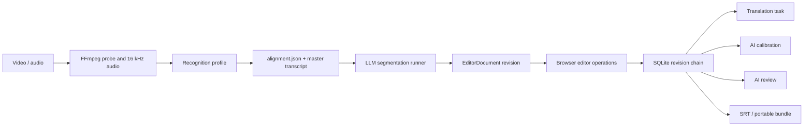

# Current data flow

## Primary product flow



## 1. Media intake and ASR

The main UI posts multipart media and frozen task settings to `app.py::create_workbench_split_job`.

Current artifact sequence:

```text
data/projects/<job-id>/
├── input/<source media>
├── workbench_task_settings.json
├── job_status.json
├── runtime.log
├── audio_16k_mono.wav
├── alignment.json
├── alignment.tsv
├── master_transcript.txt
├── chatbox_material.md
├── asr_ingest_report.json
├── run_manifest.json
├── ingest_chunks/
│   ├── qwen_cloud_audio_64k.mp3
│   ├── qwen_cloud_state.json
│   └── qwen_cloud_result.json
├── asr_original/
├── prompts/
├── playback_cache/
└── manual_web_relay/
```

`app.py::_run_ingest_worker` starts `scripts/run_ingest_worker.py`. The worker delegates to `substar_core.pipeline`, which selects a recognition profile from `substar_core/recognition/registry.py` and then invokes local or cloud adapters.

`alignment.json` is the durable ASR interchange. It contains media metadata, engine metadata, language, master text, chunks and word/alignment units. Cloud Qwen transcription additionally uses a resumable `qwen_cloud_state.json` checkpoint.

The active Qwen Cloud request sends language hints and diarization configuration, but does not currently inject glossary hotwords or a business prompt. `recognition/contracts.py` defines adapter protocols, although the active production implementations do not yet implement those protocols as their common boundary.

When a reference manuscript is supplied, the matching flow first copies the original ASR evidence to `asr_original/`, then rewrites the working transcript/alignment projection while retaining the media timing evidence. `reference_match_audit.json` records the transformation.

## 2. Segmentation and project materialization

The production main path calls `run_experimental_stage1_from_ingest`, which starts `scripts/run_stage1_experiment.py` in a child process. Despite the name, this is the current product path.

Inputs:

- `chatbox_material.md`
- prompt snapshot
- language and hard limits
- reference manuscript context when provided
- model and retry settings

Outputs include:

```text
stage1_experiment/
├── stage1_result.json
├── editor_document_v2.json
├── editor_revision_v2.json
└── route-specific responses and validation artifacts

stage_progress.json
project_v2/
├── manifest.json
└── project.sqlite3
```

`substar_core/stage1_recovery_v2.py` can materialize a completed segmentation result into the editor store after restart. If segmentation is disabled, it instead materializes the ASR sentence boundaries directly.

## 3. Canonical editor model

`substar_core/domain/editor_document.py` currently defines:

- `SourceToken`: ASR/source evidence and source timing.
- `DisplayToken`: editable token projection tied back to source tokens.
- `SemanticGroup`: grouping metadata.
- `DisplayCue`: ordered subtitle cue, timing, speaker and optional translation track.
- `TranslationTrack`: translated text and provenance.
- `PresentationSettings` and `DocumentProperties`.
- `EditorDocument`: complete editable state.
- `DocumentRevision`: immutable revision wrapper with parent and provenance.

The model already separates source evidence from the editable projection. This is the most important data boundary to retain.

`DocumentProperties.script_projection` selects the Chinese script used by revision API payloads and SRT export. `original` is the default and is omitted from serialization so existing revision hashes remain valid. A projection change creates a revision containing only the property and provenance change; it never rewrites canonical `DisplayToken.text` or `TranslationTrack.target_text`. Both tracks are projected at read/export boundaries, and a user edit made while viewing a projection materializes only the edited text through the ordinary editor operation path.

The initial `stage1_experiment/editor_document_v2.json` is a segmentation artifact, not the live document. Later edits update the SQLite revision chain and do not rewrite that initial JSON snapshot.

## 4. Editing and revision persistence

The frontend sends typed operations with a base revision/hash. The browser applies some operations optimistically, queues them, and submits batches to `/api/v2/projects/{project_id}/operation-batches`.

The backend path is:

```text
editing_endpoints
→ EditingService
→ apply_document_operation
→ ProjectRepository
→ SQLiteProjectRepository
→ ProjectStore
```

`ProjectStore` writes a revision row transactionally. Periodic revisions are complete compressed snapshots; intervening revisions are compressed patches. Checksums and expected revision IDs protect against corruption and stale writes.

## 5. Translation

Translation is started from an editor revision. `translation_service_v2.py` writes `translation_v2/status.json`, starts a daemon thread and then launches `scripts/run_production_translation.py`.

```text
translation_v2/
├── status.json
└── runs/<task-id>/
    ├── settings_snapshot.json
    ├── stdout.log
    ├── stderr.log
    ├── stage_progress.json
    ├── T1/translation_revision_v2.json
    └── substar_bilingual_final.srt
```

The translation result is tied to the expected source revision. The service can infer completion from the pointer and final SRT, but otherwise owns a lifecycle independent of the main job registry.

Translation is not merely a target-string fill. Its presentation materialization supports 1:1, 1:N and N:1 mappings and can rebuild a local cue grid, timing and cue IDs. That presentation mapping is active product behavior. The current implementation also imports private grouping/lineage helpers from `experimental/merged_max_debug.py`, creating a production-to-experiment dependency.

## 6. Calibration and review

Calibration and review are POST requests handled in `editor_api_v2.py`. Each writes an `editor_tasks_v2/<kind>.json` status projection. The API request itself performs the work synchronously and may fan out model calls with a `ThreadPoolExecutor`.

- Calibration validates proposed operations and commits an editor revision.
- Review writes `ai_review_v2/latest.json` and an editor-task status record.
- Partial block errors are retained in the review result.

These look like background tasks to the UI but do not share the main/translation runtime.

Provider requests run in a killable child process. On Windows the complete JSON request is written and stdin is closed before short cancellation polling begins; retrying `communicate(input=...)` after a polling timeout is forbidden because it can truncate a large request before the provider call starts.

## 7. Glossary and prompt flow

The glossary is stored in the selected application-data directory as `glossary.json`. Entries have global or project scope. Active entries are transformed for several consumers:

- ASR hotwords/context.
- Segmentation prompt context.
- Translation terminology rules.
- Export to/import from XLSX.

Production prompts are snapshotted into project directories for reproducibility, but prompt registry keys still expose historical route names.

The integration is incomplete: production segmentation reliably receives global entries, translation scopes by a directory/job name that may differ from the user-facing project name, the existing hotword projection has no production caller, and calibration/review do not consistently receive glossary constraints.

## 8. Settings and credentials

`substar_core/config.py` selects storage in this order:

1. portable `data/.substar-workbench` when writable;
2. per-user `%LOCALAPPDATA%/SubstarWorkbench`;
3. configured data-root fallback.

Non-secret settings use `settings.json`. Credentials use DPAPI-protected files. The project output root is forced to `<data-root>/projects` even when a legacy persisted value differs.

## 9. Export and portability

Current export paths can create source/target SRT variants, an edited portable bundle and a raw split bundle. `split_bundle.py` sanitizes/copies project artifacts and can restore an imported bundle. `workbench_routes.py` handles import and media relinking.

## Current sources of truth

| Concern | Current durable authority | Secondary projections/inference |
| --- | --- | --- |
| Editable subtitle state | `project_v2/project.sqlite3` latest revision | `manifest.json`, legacy editor JSON pointers |
| Main media job | `job_status.json` plus in-memory `JOBS` | stage artifacts and `stage_progress.json` |
| Translation job | `translation_v2/status.json` | final SRT and translation revision pointer |
| Calibration/review status | `editor_tasks_v2/*.json` | committed revision or `ai_review_v2/latest.json` |
| Cloud ASR request | `qwen_cloud_state.json` | remote provider task status |
| Batch submission | `.workbench_batches/<batch-id>.json` | status aggregated from child jobs |
| Model download | process memory only | downloaded model directory |
| Settings/glossary | application-data JSON/DPAPI files | per-project frozen settings/prompt snapshots |

The editor document has a credible single authority. Background work does not.
