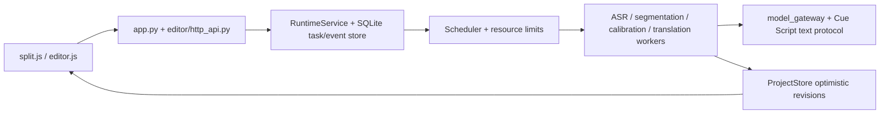

# Current system map

This page is a human entry point. The executable architecture authority is
[`system-map.json`](system-map.json); [`system-map.md`](system-map.md) and
[`system-map.mmd`](system-map.mmd) are generated from it and must not be edited
by hand. The previous pre-v2 inventory was removed because it described retired
`editor_api_v2.py`, in-memory job registries and synchronous editor AI paths.

## Runtime shape

## Current authorities

| Concern | Authority |
|---|---|
| Task lifecycle, attempts, progress and terminal state | `substar_core/runtime/` and `runtime-v2.sqlite3` |
| Editable subtitle truth | `substar_core/storage/project_store.py` |
| Provider-visible model protocol and deterministic binding | `substar_core/cue_script.py` |
| Prompt composition and stage routing | `substar_core/prompt_registry.py`, `substar_core/stage_settings.py`, `substar_core/model_routing.py` |
| Translation orchestration | `substar_core/editor/translation/` |
| Calibration orchestration | `substar_core/editor/calibration/` plus the calibration service seam in `editor/http_api.py` |
| Browser task projection | `web/ai_progress_summary.js`, consumed by split/editor UIs |

Segmentation, translation and calibration are standard Runtime tasks. Provider
work uses request-local aliases and text output; deterministic finalizers bind
that output to immutable local ledgers. Each original block gets one primary
request and at most one full-block repair request. Cloud model work does not
hold a global project-write lock; only short final publication is protected by
ProjectStore optimistic concurrency.

See [`current-structure-review-2026-09-04.md`](current-structure-review-2026-09-04.md)
for the current concentration audit and refactoring priorities.
