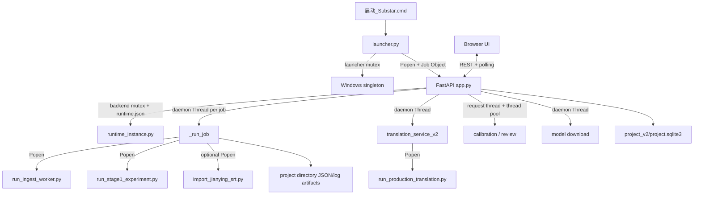

# Current system map

## Audit scope

This document describes the implementation at commit `932a5be`. It records what exists; target-state decisions belong to the next architecture phase.

## Executive finding

Substar is a local modular monolith with a browser frontend and several child-process workflows. Its business scope is compact, and the editor core already contains strong domain and persistence boundaries. The recurring communication failures come from the control plane being implemented several times with different state stores and lifecycle rules.

The two concentration points are:

- `app.py`: application assembly, settings API, job registry, media workflow orchestration, process launching, recovery, export, and compatibility behavior.
- `substar_core/editor_api_v2.py`: HTTP models, project discovery, media/waveform delivery, revision APIs, editing commands, AI operations, translation dispatch, and debug integration.

The internal Python import graph has no module cycle. The problem is responsibility concentration and duplicated lifecycle ownership, not circular imports.

## Process topology

## Startup and instance ownership

1. `launcher.py` acquires `Local\\Substar.Workbench.Singleton`.
2. It reads/probes the previous runtime identity, may terminate the recorded process tree, and launches the backend.
3. The backend separately acquires `Local\\Substar.Workbench.Backend` in `app.py::_claim_backend_instance`.
4. `substar_core/runtime_instance.py` writes `runtime.json` containing identity information.
5. The launcher assigns the backend to a Windows Job Object configured to kill children when the launcher closes.

This is defensive, but instance truth is split between two mutexes, a runtime record, an HTTP identity probe, process start-time checks, and a named Job Object.

The most important observed behavior is that a second launch does not call the existing `_open_existing()` helper. Both mutex-conflict and discovered-runtime paths enter forced takeover: the launcher verifies and terminates the recorded backend/process tree, terminates the old launcher, and starts a replacement. That behavior can interrupt active subtitle work and is a direct contributor to the reported instance-management symptoms. `--stop` also uses process termination rather than an application-level graceful shutdown.

## Backend composition

| Area | Current owner | Notes |
| --- | --- | --- |
| FastAPI assembly | `app.py` | Mounts assets and includes page/editor routers. |
| HTML pages and portable bundle import | `substar_core/workbench_routes.py` | Router is excluded from OpenAPI. |
| Editor API | `substar_core/editor_api_v2.py` | Largest dependency fan-out: 20 internal modules. |
| Main media job orchestration | `app.py::_run_job` | One daemon thread per job plus child processes. |
| Editor domain | `substar_core/domain/editor_document.py` | Typed immutable-style document entities and revisions. |
| Editing application service | `substar_core/editor/application/editing_service.py` | Already independent of HTTP and SQLite. |
| Project persistence | `substar_core/storage/project_store.py` | SQLite WAL, optimistic revision checks, snapshots plus patches. |
| Media/ASR | `substar_core/pipeline.py`, `qwen_backend.py`, `qwen_cloud_asr.py` | Multiple adapters, local/cloud execution. |
| Segmentation | `substar_core/full_pipeline.py` plus `scripts/run_stage1_experiment.py` | Production path still uses experiment/stage terminology. |
| Translation | `translation_service_v2.py`, `translation_t1mix.py`, production script | Separate task lifecycle from main jobs. |
| Calibration/review | `editor_api_v2.py` | Synchronous request handlers with internal parallel calls. |
| Settings/secrets | `substar_core/config.py` | Portable/per-user fallback and DPAPI-protected credentials. |
| Glossary | `substar_core/glossary.py` | Global JSON with global/project scopes. |

## Existing strong boundaries to preserve

- `EditorDocument`, `DocumentRevision`, provenance and stable IDs are isolated from HTTP.
- `EditingService` depends on a `ProjectRepository` protocol rather than SQLite.
- `SQLiteProjectRepository` is a small adapter around the existing store.
- `ProjectStore` provides WAL mode, full synchronous writes, busy timeout, checksums, optimistic concurrency, periodic snapshots and compact patches.
- Frontend editing already has an optimistic document store and batched operation queue.
- Artifact helpers use atomic replacement for many JSON/text writes.
- Python module imports are acyclic.

## Structural pressure points

1. `app.py` is both composition root and business/runtime implementation.
2. `editor_api_v2.py` is both router and application/domain integration layer.
3. Main jobs, translation, editor AI, debug jobs and model downloads have separate lifecycle implementations.
4. Status is spread across process memory, multiple JSON files, SQLite revisions and inferred artifact completion.
5. Provider HTTP calls partly use the shared session and partly call `requests` directly.
6. Production behavior still dispatches through files and functions named as experiments.
7. The frontend uses REST polling; there is no unified event channel.
8. Several legacy workflow modes remain reachable in backend branching even when absent from the main UI.
9. Production translation imports private grouping helpers from `experimental/merged_max_debug.py`, so the experimental package cannot be deleted until those shared domain functions are extracted.
10. The glossary exposes hotword projection, but the active Qwen Cloud ASR path does not consume it; glossary integration is only partial across ASR, segmentation, translation, calibration and review.

## Current size signals

- FastAPI application reports 80 routes including framework/internal routes.
- Frozen OpenAPI contains 61 paths and 67 documented HTTP operations.
- Two additional workbench APIs and six page routes are intentionally excluded from OpenAPI.
- `editor_api_v2.py` imports 20 internal modules; `full_pipeline.py` imports 10.
- Historical naming remains widespread: `stage1` appears in 72 active/source files and `P2mix` in 17 files when scripts, prompts and schemas are included.
