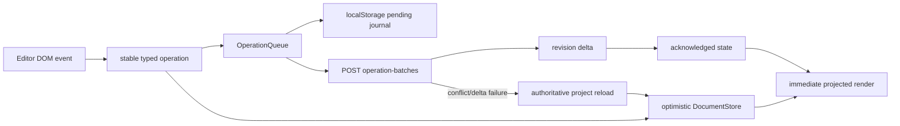
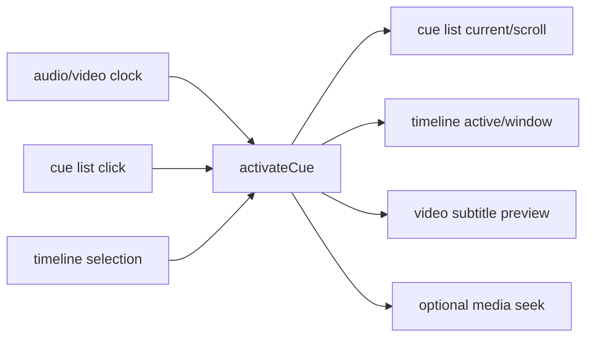

# Current frontend module map

## Executive finding

The current frontend can be preserved. It is a no-build, native HTML/CSS/JavaScript application with four clear product pages, a reusable theme system and several well-separated editor primitives. The refactor boundary should sit behind the existing views: consolidate communication, split the editor application coordinator and fix large-document hotspots without redesigning the UI.

## Page structure

| Page | Main files | Current responsibility | Refactor posture |
| --- | --- | --- | --- |
| Create/tasks | `split.html`, `split.css`, `split.js` | Upload media/reference material, freeze task settings, create jobs/batches, display progress and recent projects | Preserve UI; replace task/config adapters |
| Editor | `editor_v2.html`, `editor_v2.css`, `editor_v2.js` | Cue/token editing, translation, review, calibration, media preview, timeline, revisions and export | Preserve UI and editor primitives; split coordinator |
| Glossary | `glossary.html`, `glossary.css`, `glossary.js` | Global/project terms, filter, XLSX import/export | Preserve at current scale |
| Settings | `settings.html`, `settings.css`, `settings.js` | Providers, recognition, segmentation, translation, review, runtime and personalization | Preserve UI; introduce typed settings adapter |

## Shared visual system

| Module | Responsibility | Finding |
| --- | --- | --- |
| `shell.css` | Shared top navigation, page shell, status and responsive layout | Preserve |
| `theme/tokens.css` | Light/dark semantic tokens, accent, density, motion, typography and timeline colors | Freeze during backend work |
| `theme/personalization.js` | Theme state in local storage, per-page background in IndexedDB, `substar:themechange` event | Preserve |
| `theme/open-props-subset.css` | Vendored Open Props subset | Preserve with license |
| `ui-icons.svg`, `substar-logo.svg` | Shared icons and brand | Preserve |

The visual layer is not the source of the backend communication failures and should not be rewritten with the runtime.

## Editor modules

The editor loads modules in a fixed order from `editor_v2.html`. Foundation modules expose browser globals and mostly support CommonJS tests.

| Module | Public role | Current assessment |
| --- | --- | --- |
| `editor_v2_cue_ordering.js` | Canonical cue ordering | Keep unchanged |
| `editor_document_v2.js` | Client document validation, revisions/deltas and operation constructors | Preserve contract; remove historical field names via adapters |
| `editor_v2_document_store.js` | Acknowledged/pending/projected optimistic state | Preserve interface; optimize cloning/replay |
| `editor_v2_operation_queue.js` | 60 ms debounce, batches up to 100, retries and failure retention | Strong boundary to preserve and test |
| `editor_v2_waveform_cache.js` | LRU, in-flight deduplication and cancellation of obsolete windows | Keep |
| `editor_v2_timeline.js` | Canvas timeline, zoom/window, waveform, cue selection, boundary dragging and playhead | Keep |
| `editor_v2_cue_time_controller.js` | Convert timing intent into editor operations | Keep |
| `editor_v2_cue_list_view.js` | Incremental cue list window | Keep contract; replace unbounded accumulation |
| `editor_v2_language.js` | Language detection, CJK spacing and visible-character counts | Keep |
| `editor_v2.js` | API, project session, DOM, render, media, tasks, revisions and event orchestration | Split; currently about 3,392 lines |

## Editing state and persistence path



The local journal key is `substar.editor-v2.operations:{projectId}:{documentId}`. The acknowledged/pending/projected model, stable operation IDs and authoritative reload are mature concepts and align with the backend revision store.

## Media, waveform and cue coordination



The timeline already limits drawing to a visible window, binary-searches cue starts, caches a static offscreen layer and draws the playhead separately. Waveform requests are windowed, capped at 4,096 points, deduplicated, cached and cancellable. Media playback prefers `requestVideoFrameCallback` with an animation-frame fallback. These mechanisms should remain.

## Current communication map

There is no shared browser API client. `split.js`, `editor_v2.js`, `settings.js` and `glossary.js` each define different `fetch` wrappers and error behavior.

| Page | Primary API surfaces | Update mechanism |
| --- | --- | --- |
| Create/tasks | `/api/workbench/split-*`, `/api/jobs`, `/api/v2/editor-tasks`, settings/system/profiles | Two task lists polled every 1.3 s |
| Editor | `/api/v2/projects/*`, plus workbench rename | Direct requests; translation about 1 s polling; debug about 850 ms polling; calibration/review are long POSTs |
| Settings | `/api/settings`, runtime, recognition, environment, models/assets | Direct requests; download polling |
| Glossary | `/api/glossary` and XLSX endpoints | Direct full read/write |

The create page reconstructs one user workflow from `workflow_mode`, main-job status, editor-task status and historical stage progress. This makes the browser responsible for backend orchestration semantics.

## Browser-local state

| State | Store | Notes |
| --- | --- | --- |
| Create-page task configuration | `localStorage: substar.split.task-config.v1` | Duplicates/folds backend settings fields |
| Pending editor operations | `localStorage: substar.editor-v2.operations:*` | Valuable crash/reload journal |
| Theme/personalization | localStorage plus IndexedDB | Browser-specific by design |
| Provider-connected labels | `localStorage: substar.settings.connected-providers.v1` | Separate from backend credential truth |
| AI review backup | localStorage plus server result | Recovery projection, not sole authority |
| Settings/glossary | backend JSON APIs | Settings auto-save is debounced and serialized; glossary saves the full DOM-derived list |

## Coupling and correctness risks

1. `split.js` knows `workflow_mode`, old branch/stage names and multiple status schemas.
2. `settings.js` mirrors a large backend settings schema and copies provider/stage fields itself.
3. `editor_v2.js` mixes transport, state, task coordination, playback, rendering and DOM events.
4. Project renaming uses a split-job endpoint, coupling editor project identity to execution identity.
5. Quickly switching project A to B can allow A's late response to overwrite B because the load result is not guarded by a session/generation token.
6. Long AI POSTs lack a durable task ID, cancellation and reconnect behavior.
7. Historical names such as `P2mix`, `T1mix`, `production_*`, `stage1` and branch `A` leak into browser configuration and rendering logic.

## Large-document performance risks

| Priority | Hotspot | Current behavior | Required direction |
| --- | --- | --- | --- |
| High | Playback-time cue lookup | Linear `Array.find` on video frames | Share a binary-search time index |
| High | Optimistic document projection | JSON-deep-clones the revision and replays all pending operations | Structural sharing or entity-local patches behind the same store API |
| High | Revision application | Rebuilds the full editor view and indexes after each edit | Incremental entity/index updates where safe |
| Medium-high | Cue list | Appends windows but never evicts distant DOM nodes | Fixed virtual window with spacers |
| Medium | Task updates | Several independent poll loops can overlap on slow requests | One replayable task-event client with polling fallback |
| Medium | Timeline view input | Some view preparation still constructs all cue text | Feed only indexed/window data where practical |

## Proposed internal seams for the later refactor

These are responsibility seams, not a Phase 1 implementation decision:

```text
ApiClient / compatibility adapters
TaskClient (event replay + polling fallback)
ProjectRepository (browser transport boundary)
EditorSession (revision, selection, pending operations)
PlaybackCoordinator (media/cue/timeline synchronization)
EditorRenderer (DOM regions and virtual cue list)
```

## Test gaps

Current direct JavaScript tests cover cue-list boundary clamping and multilingual character counting. Missing high-value coverage includes:

- `EditorDocumentV2` schemas, operations and deltas;
- optimistic store/queue retry, duplicate operation, stale revision and reload behavior;
- waveform cache and timeline timing intents;
- rapid project-switch response ordering;
- 10,000-cue time lookup, document projection and list virtualization;
- shared API error/timeout/cancellation semantics;
- media, cue list and timeline integration.

## Preserve/change boundary

Preserve the four pages, visual design, theme, media loading, timeline, waveform cache, typed editor contract and optimistic operation protocol. Change the communication adapters, the oversized page coordinator, task-status consumption and the three measured large-document hotspots. This keeps the existing frontend design while allowing the backend runtime to be replaced underneath it.
