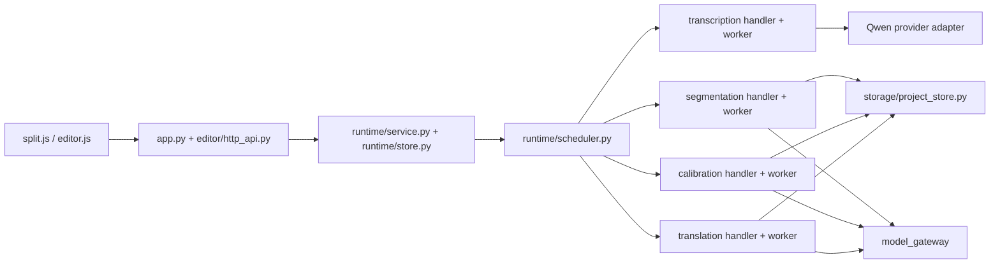

# Current implemented module architecture

This record describes the v2 implementation after Phase 10. The generated
[`../system-map.json`](../system-map.json) remains the executable authority.

## End-to-end ownership

## Authorities

| Concern | Sole authority |
| --- | --- |
| Task lifecycle, counts, repair eligibility, locks and terminal state | `runtime-v2.sqlite3` through `RuntimeService` |
| Provider/model/key/thinking/reasoning snapshot | task input frozen before scheduling and executed through `model_gateway` |
| Project discovery | `data/projects-v2`; `data/projects` is never scanned or opened |
| Editable subtitle truth | current v2 `EditorDocument` revision in `ProjectStore` |
| Calibration and translation execution | runtime handlers/workers; retired editor task repository and translation service are absent |
| Partial delivery | successful units plus explicit editable unresolved slots, terminal state `succeeded_with_issues` |
| Repair budget | one task-wide repair phase; each failed unit can be requested at most once |
| AI review | external exchange only; it is not an internal runtime task |

## Production workers

- `scripts/run_transcription_worker.py`
- `scripts/run_segmentation_worker.py`
- `scripts/run_semantic_segmentation.py`
- `scripts/run_calibration_worker.py`
- `scripts/run_translation_worker.py`

The Windows build copies only these worker entry points. Git history is the
archive for retired implementations; the release does not ship importable
legacy task repositories, Stage 2 orchestration, or project migration code.

## Frontend projection

Creation, segmentation, calibration and translation use the same runtime task
shape. The split page shows creation plus follow-on AI tasks; the editor shows
project calibration and translation tasks. Both derive phase, `completed/total`,
repair state and terminal issues from the runtime response rather than local
synthetic status.

## Breaking v2 boundary

- runtime store schema: v3 in `runtime-v2.sqlite3`;
- project store: manifest v4/database schema 3 under `projects-v2`;
- editor documents: exact current schema only;
- tutorial project/example manifests: v2 only;
- credentials: portable `substar.credentials.v2` envelope only;
- glossary: exact current library schema only.

Old files remain untouched on disk but are not discovered, read, normalized,
imported or migrated.
