# Current implemented module architecture

This map describes the code running after Phase 9. It is an ownership map, not
a migration proposal.

## End-to-end flow

```mermaid
flowchart LR
  CREATE["web/split.js\nproject creation"]
  APP["app.py\ncomposition and workbench facade"]
  GRAPH["workbench/subtitle_creation.py\ndurable workflow graph"]
  TASK["runtime/service.py + store.py\ntask authority"]
  SCHED["runtime/scheduler.py + supervisor.py\nattempt and process ownership"]
  ASR["transcription/handler.py + worker.py\nrecognition evidence"]
  SEG["segmentation/handler.py + worker.py\nvalidated segmentation"]
  PLAN["segmentation/execution_planner.py\ndeterministic 180 s planning"]
  SEM["run_semantic_segmentation.py\nsemantic grouping"]
  BUILD["contracts/editor_document.py\ninitial editor document"]
  STORE["storage/project_store.py\nrevision authority"]
  EDITOR["editor/http_api.py + web/editor.js\neditor session"]
  AI["editor/tasks/repository.py\nexclusive AI task state"]
  CAL["AI calibration"]
  TRAN["editor/translation/service.py\ncontextual translation"]
  REVIEW["AI review"]

  CREATE --> APP --> GRAPH --> TASK --> SCHED
  SCHED --> ASR --> SEG --> PLAN --> SEM --> BUILD --> STORE
  EDITOR <--> STORE
  EDITOR --> AI
  AI --> CAL
  AI --> TRAN
  AI --> REVIEW
```

## Module ownership

| Boundary | Modules | Sole responsibility |
| --- | --- | --- |
| Desktop instance | `launcher.py`, `runtime_instance.py` | One backend instance, verified graceful shutdown and process-tree fallback |
| Settings and credentials | `config.py`, `credential_store.py`, `security.py` | Non-secret settings and purpose/provider credential roles |
| Task state | `runtime/model.py`, `store.py`, `service.py`, `api.py` | Task identity, attempts, state transitions, events, idempotency and cancellation |
| Worker ownership | `runtime/scheduler.py`, `supervisor.py`, `worker_protocol.py` | Resource claims and exactly one owner for every worker process/tree |
| Recognition | `transcription/contracts.py`, `handler.py`, `worker.py`, `qwen_cloud_asr.py` | Immutable word/sentence/speaker evidence and resumable provider checkpoints |
| Execution planning | `segmentation/execution_planner.py` | Deterministic blocks near 180 seconds using sentence ends and low-volume gaps |
| Semantic grouping | `segmentation/contracts.py`, `handler.py`, `worker.py`, `scripts/run_semantic_segmentation.py` | Prompt-bound grouping and final display cuts; no ASR calibration |
| Editor materialization | `contracts/editor_document.py`, `segmentation/document_builder.py`, `segmentation/materializer.py` | Create a canonical editor document and sentence-boundary-only projects |
| Project revisions | `storage/project_store.py` | SQLite revision chain and latest pointer under each `project/` directory |
| Editor HTTP | `editor/http_api.py` | `/api/editor`, media/range, waveform, mutations, export, calibration and review |
| Manual editing | `editor/application/*`, `document_operations.py`, `validation.py`, `export.py` | Conflict-checked immutable edit operations and validation |
| AI exclusivity | `editor/tasks/contracts.py`, `repository.py` | One calibration/translation/review task per project and backend-enforced read-only state |
| Translation | `editor/translation/service.py`, `contextual.py`, `grouping.py` | Source-bound task state, grouping, translation result and stale-cue detection |
| Browser editor | `web/editor.js`, `editor_document.js`, `editor_document_store.js`, `editor_operation_queue.js` | Session coordination, document projection and ordered optimistic edits |
| Browser performance | `editor_cue_list_view.js`, `editor_timeline.js`, `editor_waveform_cache.js`, `editor_cue_time_controller.js` | Bounded cue rendering, waveform windows and cue/media synchronization |

## Frozen responsibilities

- Recognition owns evidence; segmentation may not rewrite recognized text.
- Deterministic planning owns cross-block boundaries; semantic grouping owns
  meaning groups and cue cuts inside those blocks.
- A valid segmentation result immediately creates an editable project.
- Calibration, translation and review are editor AI tasks. They may run in any
  user-selected order, but only one may own the project at a time.
- While an editor AI task is active, both the browser and backend reject manual
  mutation. The backend lock is authoritative.
- Calibration auto-applies only validated high-confidence actions. Review emits
  source and translation issues with separate taxonomies and user-controlled
  resolution state.

## Public naming

Production routes and files use `editor`, `segmentation`, `translation`,
`calibration` and `review`. Historical project formats, routes and
experiment-stage labels are unsupported and absent from the production import
graph.

## Remaining large coordinator

`app.py` remains the composition root and workbench facade, while
`web/editor.js` remains the largest browser coordinator. New domain logic must
go into the focused modules above; neither file may become a new lifecycle or
data authority.
