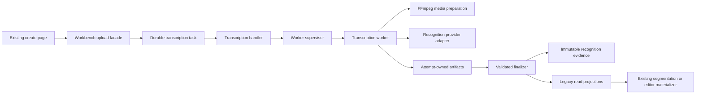

# Phase 4 implementation record: canonical transcription cutover

Status: implemented and regression-tested on 2026-08-16.

## Scope

This phase moves the production media-preparation and word-level transcription
boundary onto the durable runtime created in Phase 3. It deliberately does not
move segmentation, translation, calibration or review. The existing create
page, project list, editor HTML/CSS and editor document contract remain usable
through a compatibility facade.

The cutover has one production owner: a workbench ASR upload creates one
canonical `transcription` task. The legacy coordinator only waits for that task
and then invokes the still-unmigrated downstream project materializer. It no
longer starts or owns an ASR subprocess.

## Implemented module boundary



Small-module ownership is now:

| Module | Sole responsibility |
| --- | --- |
| `substar_core/transcription/contracts.py` | Strict request, evidence and result contracts; input fingerprinting; legacy alignment projection |
| `substar_core/transcription/handler.py` | Runtime registration, project/media containment, resource claim, trusted progress projection and final publication |
| `substar_core/transcription/worker.py` | Worker-protocol execution, one-capability credential consumption, retry checkpoint seeding, FFmpeg/provider invocation and attempt artifacts |
| `scripts/run_transcription_worker.py` | Stable worker process entry point only |
| `substar_core/qwen_cloud_asr.py` | Qwen file-transcription request, polling, cancellation and input-bound checkpoint behavior |
| `substar_core/runtime/*` | Provider-agnostic lifecycle, process ownership, events, artifact registration and recovery |
| `app.py` workbench adapter | Existing multipart shape, stable project identity, submission idempotency and temporary legacy workflow projection |
| `web/split.js` | Existing UI with a stable per-selection idempotency key and separate cancel/delete wording |

No canonical file introduced by this phase contains a historical stage,
experiment or mixed-route name.

## Frozen contracts

### Transcription request

`substar.transcription-request.v1` contains:

- a project-relative media path, byte size and SHA-256;
- recognition profile and requested language;
- prompt/context snapshot;
- normalized hotword snapshot compiled from the active glossary;
- a strict allowlist of non-secret provider/media options;
- a canonical fingerprint over the complete request.

Absolute host paths, API keys, tokens and unrelated downstream settings are
rejected or omitted. The worker command may contain a supervisor-private
resolved path, but the durable task input and public result never do.

### Recognition evidence

`substar.recognition-evidence.v1` is the immutable authority for provider
output. It records media identity, engine audit, sentence timing, word/character
timing, speaker fields supplied by the provider, hashes of the prompt and
hotword snapshots, and digest references to the exact provider-submission
audit and optional private raw provider response. Timing, index order, media
binding and request binding are validated before publication.

The mutable `alignment.json`, transcript, TSV and segmentation material are
compatibility projections rebuilt by the finalizer. Reference-document
matching may change only those projections; it cannot overwrite recognition
evidence.

### Result

`substar.transcription-result.v1` exposes the recognition-evidence digest and
size, a validated non-secret summary and the compatibility filenames. The
worker result artifact set must exactly equal the current attempt's durable
artifact registry. Every artifact is size- and digest-checked by both the
supervisor/runtime and the type-specific finalizer.

The JSON Schemas live in `docs/architecture/target/contracts/` and are checked
against the runtime validators.

## Provider, recovery and cancellation behavior

- The production handler is registered at application startup; an empty
  registry can no longer accept a workbench transcription.
- The application resolves only the credential references explicitly claimed
  by the handler and injects those values into temporary worker-process slots.
  The worker never opens the application credential store; unrelated secret
  environment variables are removed before launch. Secret values are not
  stored in SQLite, the worker command, public errors or registered artifacts.
- Qwen file-transcription requests carry the provider-family-specific language,
  context, weighted vocabulary, diarization and timestamp options. A public
  audit captures the exact effective prompt/vocabulary payload after provider
  limits, while the raw response remains private attempt data. Returned speaker
  fields survive normalization.
- Provider checkpoints are private attempt data. Reuse requires the exact
  transcription fingerprint, provider model and provider base URL.
- A changed media, language, prompt, hotword snapshot or provider setting
  cannot reuse an earlier remote result.
- Retry searches earlier attempts newest-first and copies prepared audio or a
  private provider checkpoint only from a usable attempt with the exact same
  request fingerprint. An empty intermediate attempt cannot lose a valid
  remote task identity.
- Worker cancellation is checked before upload/submission, during every poll
  and during interruptible poll waits.
- A running workbench cancellation remains `cancelling` until the supervisor
  proves process-tree exit. It then becomes `cancelled` while the project
  directory is retained. Deletion is a separate, recoverable move to trash.

## Frontend compatibility and communication

The create page still posts its existing multipart fields and still consumes
the legacy `/api/jobs` array. Its visual layout and editor entry flow did not
change.

The facade keeps `job.id` as the stable `project_id` and exposes a distinct
`transcription_task_id`. A transcription task reaching `succeeded` is not
misrepresented as editor-ready. The facade reports `awaiting_edit` only after
the existing downstream materializer has produced a readable V2 project and
revision.

Every media selection receives a browser-generated `Idempotency-Key`. The key
survives a lost response while that selection remains active. The backend
persists the key and a content/settings fingerprint:

- exact replay returns the original project and task;
- concurrent/repeated replay cannot submit a second provider task;
- reuse with different media, reference material or settings returns `409`;
- a batch persists one ordered members/settings fingerprint before any child
  project is created; exact replay returns the original batch, while reorder,
  append, removal or settings changes return `409` before item creation;
- batch items derive stable child keys from that batch identity.

## Verification

- Strict request/evidence/result JSON Schema tests pass.
- The production handler runs through the real scheduler, supervisor, worker
  protocol, FFmpeg process and finalizer in tests.
- Qwen adapter tests cover context compilation, real model audit fields,
  speaker normalization, matching-checkpoint reuse and mismatch rejection.
- Compatibility integration tests cover response-lost replay, batch member and
  order conflicts, one-project/one-task identity, readable editor gating,
  cancellation-intent recovery after restart, separate deletion and removal of
  the old public ASR creation bypass.
- Runtime, supervisor, scheduler, launcher, API, editor and packaging
  regressions all pass under strict `ResourceWarning` handling: 111 Python
  tests.
- The preserved editor JavaScript suite passes: 4 tests.

The supplied real fixture
`C:/Users/Administrator/Downloads/9_d0JdVfQ-0eY_-E.mp4` passed the repeatable
acceptance harness using real upload handling, byte hashing, FFprobe, FFmpeg
audio extraction, scheduler/supervisor execution, artifact validation and V2
editor materialization. The recognition response was deterministic and local,
so this architectural acceptance did not spend cloud API quota.

Observed fixture facts:

- byte size: `9,521,125`;
- SHA-256: `e11f63ac3d8d7196f1e36702b524d4c5bc46998209faa4029271598cc55d28b3`;
- duration: `85.101` seconds;
- canonical state: `succeeded`;
- compatibility state: `awaiting_edit`;
- registered artifacts: `9`;
- editor revision, media and waveform source: readable;
- exact replay: same project/task, no duplicate submission.

The acceptance can be repeated without modifying product data:

```powershell
python scripts/verify_transcription_cutover.py "C:\Users\Administrator\Downloads\9_d0JdVfQ-0eY_-E.mp4"
```

## Remaining boundary

The following are intentionally not claimed as complete in Phase 4:

- segmentation and initial document construction still run behind the legacy
  workflow coordinator;
- translation, calibration and review still have their previous lifecycle
  implementations;
- the create page still polls the compatibility task projection; historical
  ledger keys remain internal to the reader but are rendered with canonical
  product labels;
- resource claims remain conservative across recognition profiles;
- the large compatibility coordinator remains in `app.py` until its downstream
  workflow is cut over; its old public media-creation endpoint is disabled;
- a live paid-provider smoke call remains an explicit release/configuration
  check rather than an automated architectural test.

The next phase should cut over segmentation and the initial editor-document
finalizer. That is the point where subtitle creation becomes a durable
transcription-to-segmentation dependency graph and the last legacy coordinator
thread can be removed.
