# Phase 5 implementation record: canonical segmentation cutover

Status: implemented and regression-tested on 2026-08-17.

## Scope

This phase moves subtitle segmentation and initial editor-document publication
onto the durable runtime. A normal ASR subtitle-creation request now creates a
two-task graph: `transcription` followed by `segmentation`. The existing create
page, project list, editor HTML/CSS and V2 editor-document behavior are kept by
a temporary read-model facade.

Translation, calibration and review remain downstream compatibility work for
Phase 6. They do not own transcription or segmentation lifecycle state.

## Production ownership

```mermaid
flowchart LR
    UI["Existing create page"] --> FACADE["Workbench command adapter"]
    FACADE --> TRANSCRIPTION["Durable transcription task"]
    TRANSCRIPTION -->|"atomic succeeded dependency"| SEGMENTATION["Durable segmentation task"]
    SEGMENTATION --> WORKER["Supervised segmentation worker"]
    WORKER --> CANDIDATE["Immutable candidate artifacts"]
    CANDIDATE --> FINALIZER["Validated project finalizer"]
    FINALIZER --> STORE["ProjectStore revision 1"]
    STORE --> READY["Editor-ready projection"]
```



The normal ASR path no longer launches the legacy workflow thread. The legacy
coordinator is used only when an explicitly selected translation, calibration
or review step still needs its Phase 6 adapter.

## Module boundaries

| Module | Sole responsibility |
| --- | --- |
| `substar_core/segmentation/contracts.py` | Strict request/candidate/result contracts, path and digest validation, canonical fingerprinting |
| `substar_core/segmentation/worker.py` | Worker protocol, reference projection, segmentation algorithm invocation and attempt-owned artifact production |
| `substar_core/segmentation/document_builder.py` | Pure sentence-boundary document building and canonicalization of compatibility algorithm output |
| `substar_core/segmentation/handler.py` | Resource declaration, trusted progress mapping, artifact validation and the sole initial `ProjectStore` commit |
| `scripts/run_segmentation_worker.py` | Stable segmentation worker entry point |
| `scripts/run_semantic_segmentation.py` | Canonically named candidate-only adapter for the established semantic algorithm |
| `substar_core/workbench/subtitle_creation.py` | Frozen prompt/reference snapshots and durable transcription-to-segmentation graph creation |
| `substar_core/workbench/task_projection.py` | Temporary projection of canonical task truth into the existing `/api/jobs` shape |
| `substar_core/runtime/store.py` | Atomic publication of a queued task and all succeeded-dependency edges |

The existing semantic algorithm is temporarily called through a candidate-only
adapter. It cannot commit a project revision or publish lifecycle state. Its
historical filenames and settings are private compatibility inputs; canonical
artifacts, API data and UI labels use business names.

## Frozen contracts and artifacts

`substar.segmentation-request.v1` binds the task to:

- the exact transcription task, input fingerprint and media SHA-256;
- a project-relative immutable recognition-evidence artifact;
- semantic or recognizer-boundary mode;
- a frozen prompt-tree digest and file count;
- a frozen glossary snapshot;
- an optional project-relative reference-document digest;
- an allowlisted provider policy and deterministic constraints.

The worker publishes exactly six registered attempt artifacts:

1. `segmentation_request.json`;
2. `segmentation_candidate.json`;
3. `editor_document_candidate.json`;
4. `segmentation_validation.json`;
5. `segmentation_manifest.json`;
6. `reference_match.json`.

The finalizer checks every size, SHA-256, schema, request fingerprint, cue count,
document hash, media binding and recognition-evidence binding before committing.
Only the finalizer may create revision 1. Replayed finalization is idempotent;
a different existing revision is a conflict rather than an overwrite.

Reference manuscripts never mutate recognition evidence. When reference text
changes the editor source-token projection, every projected token records its
source ASR index and must remain inside that source token's timing envelope.

## Lifecycle and editor-ready behavior

- Task creation and dependency insertion share one SQLite transaction. A live
  scheduler cannot claim segmentation in the gap before its dependency exists.
- A successful transcription is not editor-ready; it only unblocks segmentation.
- Cancellation is requested for both task identities and remains durable across
  process restart. Project deletion stays a separate recoverable action.
- Retry targets only canonical failed/interrupted tasks; it does not resubmit a
  succeeded provider task.
- The compatibility facade reports `awaiting_edit` only when segmentation is
  succeeded and `ProjectStore.load_latest()`, source media and waveform audio are
  all readable.
- Both semantic segmentation and the intentional recognizer-boundary mode go
  through the same worker, artifact and finalizer contracts.

## Verification

Focused coverage includes strict JSON Schemas, idempotent graph replay, atomic
dependencies, cancellation, retry/restart projection, reference-provenance
validation, one-revision publication and the segmentation-disabled mode.

The supplied fixture
`C:/Users/Administrator/Downloads/9_d0JdVfQ-0eY_-E.mp4` passed the end-to-end
acceptance harness with real upload handling, FFprobe, FFmpeg audio extraction,
the scheduler/supervisor boundary and deterministic local provider adapters.
No cloud quota was used.

Observed fixture facts:

- byte size: `9,521,125`;
- SHA-256: `e11f63ac3d8d7196f1e36702b524d4c5bc46998209faa4029271598cc55d28b3`;
- duration: `85.101` seconds;
- transcription state: `succeeded`, 9 registered artifacts;
- segmentation state: `succeeded`, 6 registered artifacts;
- editor state: `awaiting_edit`, one readable revision, media and waveform ready;
- exact upload replay: same project and task identities.

Repeat the acceptance without modifying product data:

```powershell
python scripts/verify_transcription_cutover.py "C:\Users\Administrator\Downloads\9_d0JdVfQ-0eY_-E.mp4"
```

## Remaining boundary

Phase 5 does not claim that every historical reader has been removed. The
candidate-only semantic adapter still reads the established algorithm's private
files and old settings keys. This debt is isolated from lifecycle ownership and
canonical outputs; it will move under the compatibility boundary during final
naming cleanup.

Phase 6 should cut over translation first, then calibration and review, using
revision-bound tasks and one finalizer per mutating operation. Once those steps
are canonical, the remaining legacy workflow coordinator can be removed rather
than shortened again.
