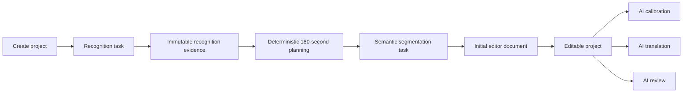

# Phase 9 release acceptance

Phase 9 closes the continuous refactor sequence. The product now runs as one
local modular monolith with durable task ownership, canonical recognition and
segmentation tasks, one editor revision authority, and one exclusive editor AI
task per project.

## Accepted production flow

- Recognition owns words, sentence timing, speaker evidence, provider resume
  state and input fingerprints.
- Execution planning chooses cross-block boundaries near 180 seconds from
  sentence endings and low-volume gaps. Semantic segmentation starts directly
  from those blocks and does not perform ASR calibration.
- A validated segmentation result creates revision 1 and immediately exposes
  the project to the editor.
- Calibration, translation and review are independent editor AI tasks. They can
  be run in any user-selected order, but only one may be active for a project.
  The browser becomes read-only and the backend rejects concurrent writes.
- `substar.editor-operation.v1` remains a user document edit command.
  `substar.editor-ai-task.v1` is the separate, clearly distinguishable
  exclusive AI-task state contract.

## Storage and naming cutover

- Project revision storage is `project/`; the new release does not scan or
  migrate former version-labelled paths.
- The browser and HTTP surface use `/editor` and `/api/editor`.
- Production settings, routes and UI no longer expose experiment-stage names or
  debug controls. Version suffixes remain only where they are real wire schema
  versions.
- Only current-schema project metadata is accepted; unsupported user folders
  are left untouched and excluded from discovery.

## Release evidence

### Real-media vertical acceptance

The release verifier processed
`C:/Users/Administrator/Downloads/9_d0JdVfQ-0eY_-E.mp4` through the real media
and FFmpeg path with deterministic provider adapters:

| Check | Result |
| --- | --- |
| Input size | 9,521,125 bytes |
| SHA-256 | `e11f63ac3d8d7196f1e36702b524d4c5bc46998209faa4029271598cc55d28b3` |
| Media duration | 85.101 seconds |
| Recognition task | succeeded; fingerprint-bound evidence |
| Segmentation task | succeeded; six registered artifacts |
| Workflow projection | `awaiting_edit` |
| Idempotent replay | same project, no duplicate task submission |
| Editor handoff | revision 1, media and waveform readable |

This verifies local orchestration and artifacts without spending or depending
on a cloud provider.

The browser-created project `20260817_155544_split_e90dee` was then accepted
against the real Qwen and DeepSeek services. Qwen produced 11 registered
recognition artifacts. A provider status presentation update initially exposed
a decreasing-progress bug (`RUNNING` 46% followed by `SUCCEEDED` 40%); the
runtime correctly rejected it even though all files were valid. The adapter now
emits progress only for active states and the worker boundary independently
drops regressive updates. Retry reused the completed, input-fingerprint-bound
Qwen result without uploading or submitting again. DeepSeek segmentation then
completed, producing a 33-Cue English project at revision 1 and a non-empty SRT
export.

### Browser acceptance

- Existing projects remained discoverable and editable after the storage
  migration and backend restart.
- A hide-Cue edit followed by undo preserved every command-bar child position
  and width exactly, closing the AI-review/reference-document layout jump.
- Source and workbench SRT exports both returned HTTP 200 and non-empty files.
- The settings UI contains no debug panel; both saved provider credentials pass
  their live connectivity checks.
- A 10,000-Cue list renders only the active 160-Cue window.

## Operational result

Graceful launcher shutdown and restart produced a new instance identity while
preserving the readable editor projects, durable retry state and all canonical
revision directories. No former version-labelled project directory remained in
active project storage. The complete Qwen recognition to DeepSeek segmentation
to editor handoff now has real-provider evidence as well as deterministic
acceptance coverage.
