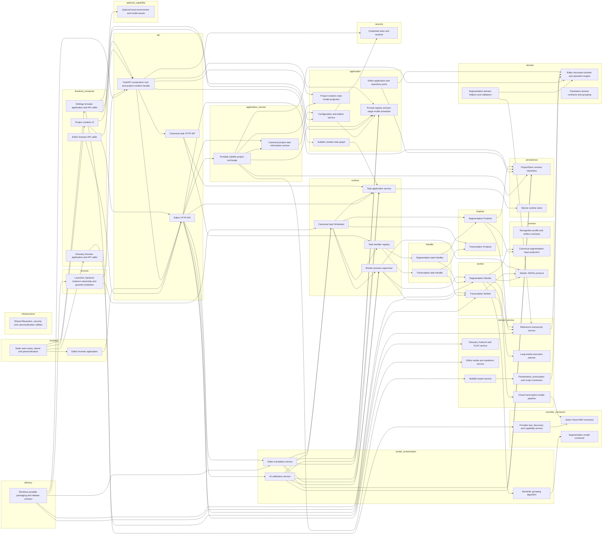

# Substar executable system map

> Generated from `docs/architecture/system-map.json` by `scripts/system_map.py`. Do not edit this file by hand.

This is the current human- and machine-consumable architecture authority. It covers process ownership, browser API callers, backend APIs, task runtime, provider connectors, Workers, Finalizers, editor services, settings, glossary, export and packaging.

## Mandatory change rule

- Read this map before changing a business contract, task state, worker protocol, provider connector or persistent artifact.
- List every affected module and contract before editing code.
- Do not change only a producer or only a consumer.
- Finalizers validate identity, integrity and structure; they never invent or rewrite semantic content.
- Retry preserves independently accepted work and reruns only unresolved or uncommitted work.
- Update this map and its registered tests in the same change as the code.

A canonical contract change is incomplete until all of these are checked: `producer`, `persistent_artifact`, `consumer`, `finalizer`, `retry_or_recovery`, `difference-bearing_end_to_end_test`.

## Whole-system call graph

## Module index

| Module | Layer | Responsibility | Code | Inputs | Outputs | Calls |
|---|---|---|---|---|---|---|
| `split_ui` | `frontend_connector` | Collect media, source-language-aware normal/reference-script segmentation settings and frozen break symbols, create projects, and project durable task progress. | `web/split.js` `web/ai_progress_summary.js` | `project_creation_projection` | `project_creation_request` | `composition_root` `editor_api` |
| `composition_root` | `api` | Own process startup, router composition, uploads, stable project identity, prompt-component HTTP boundaries and the project-creation facade. | `app.py` | `project_creation_request` `task_record` `editor_revision` `credential_reference` `production_prompt_component` | `project_creation_projection` `transcription_request` `segmentation_request` `production_prompt_component` | `creation_graph` `creation_projection` `runtime_api` `editor_api` `credential_store` `model_stage_scheduler` |
| `creation_graph` | `application` | Freeze prompt/reference snapshots and create transcription then segmentation tasks with an explicit dependency. | `substar_core/creation/graph.py` | `transcription_request` `segmentation_request` | `task_record` | `task_service` |
| `creation_projection` | `application` | Combine transcription, segmentation and ProjectStore facts into one UI-safe creation status. | `substar_core/creation/projection.py` | `task_record` `editor_revision` | `project_creation_projection` | — |
| `runtime_api` | `api` | Validate canonical task requests and expose create, list, cancel, retry, events and artifacts. | `substar_core/runtime/api.py` | `task_record` | `task_record` `task_event` | `task_service` `handler_registry` |
| `task_service` | `runtime` | Provide validated task lifecycle operations and redact secrets before persistence or publication. | `substar_core/runtime/service.py` | `task_record` `task_event` | `task_record` `task_event` | `runtime_store` |
| `runtime_store` | `persistence` | Persist tasks, attempts, leases, dependencies, events and artifact registrations transactionally. | `substar_core/runtime/store.py` `substar_core/runtime/model.py` | `task_record` `task_event` | `task_record` `task_event` | — |
| `handler_registry` | `runtime` | Bind each canonical task type to validate_input, prepare, event handling, finalize and resource requirements. | `substar_core/runtime/registry.py` | `task_record` `worker_message` `worker_completion` | `worker_command` | `transcription_handler` `segmentation_handler` |
| `scheduler` | `runtime` | Claim queued tasks, arbitrate resources, launch Workers, consume events and invoke the matching Finalizer. | `substar_core/runtime/scheduler.py` | `task_record` `worker_message` `worker_completion` | `task_event` `worker_command` | `task_service` `handler_registry` `worker_supervisor` `transcription_finalizer` `segmentation_finalizer` |
| `worker_supervisor` | `runtime` | Own exactly one Worker process tree per handle, enforce JSONL protocol, timeout, cancellation, drain and cleanup. | `substar_core/runtime/supervisor.py` | `worker_command` `worker_message` | `worker_message` `worker_completion` | `worker_protocol` `transcription_worker` `segmentation_worker` |
| `worker_protocol` | `contract` | Strictly serialize and parse Worker command, control and message envelopes. | `substar_core/runtime/worker_protocol.py` | `worker_command` `worker_message` `credential_reference` | `worker_command` `worker_message` | — |
| `credential_store` | `security` | Persist purpose/provider-named secrets in the portable data root and resolve them only into the owning Worker process environment. | `substar_core/credential_store.py` `substar_core/security.py` `app.py` | `credential_reference` | `credential_reference` | — |
| `transcription_handler` | `handler` | Validate immutable transcription input, resolve media/safe retry material and prepare the transcription Worker. | `substar_core/transcription/handler.py` | `transcription_request` `task_record` `credential_reference` | `worker_command` | `transcription_worker` `transcription_finalizer` |
| `transcription_worker` | `worker` | Prepare media, call the configured recognition pipeline, materialize evidence artifacts and emit registered results. | `substar_core/transcription/worker.py` `scripts/run_transcription_worker.py` | `worker_command` `transcription_request` `credential_reference` | `worker_message` `transcription_result` `recognition_evidence` `provider_submission_audit` | `cloud_transcription_pipeline` `worker_protocol` |
| `cloud_transcription_pipeline` | `domain_service` | Probe media, extract canonical audio, invoke Qwen ASR and materialize provider-independent evidence files. | `substar_core/transcription/cloud_pipeline.py` | `transcription_request` `credential_reference` | `recognition_evidence` `provider_submission_audit` | `qwen_connector` |
| `qwen_connector` | `provider_connector` | Upload audio, submit asynchronous Qwen transcription, poll, download and parse sentence/word/speaker evidence. | `substar_core/qwen_cloud_asr.py` `substar_core/qwen_enhancement.py` `substar_core/http_client.py` | `transcription_request` `credential_reference` | `provider_submission_audit` `recognition_evidence` | — |
| `transcription_finalizer` | `finalizer` | Revalidate registered evidence artifacts and atomically publish immutable transcription evidence into the project. | `substar_core/transcription/handler.py` | `transcription_request` `transcription_result` `recognition_evidence` `provider_submission_audit` `worker_completion` | `transcription_result` `recognition_evidence` `task_record` | — |
| `segmentation_handler` | `handler` | Validate immutable segmentation input, resolve evidence/prompts/reference and prepare a normal or artifact-recovery Worker. | `substar_core/segmentation/handler.py` | `segmentation_request` `recognition_evidence` `credential_reference` `task_record` | `worker_command` | `segmentation_worker` `segmentation_finalizer` |
| `segmentation_input_contract` | `contract` | Derive one unpunctuated, reindexed editor timeline from immutable recognition evidence, expanding CJK blocks by character and retaining alphabetic words. | `substar_core/segmentation/input_contract.py` | `recognition_evidence` | `segmentation_material` | — |
| `segmentation_worker` | `worker` | Build canonical material, run semantic grouping, deterministic reference-script alignment, or artifact recovery, validate candidates and emit every artifact before result. | `substar_core/segmentation/worker.py` `scripts/run_segmentation_worker.py` | `worker_command` `segmentation_request` `recognition_evidence` `segmentation_material` `credential_reference` | `worker_message` `semantic_grouping_result` `segmentation_candidate` `segmentation_result` `editor_document` | `segmentation_input_contract` `reference_manuscript_service` `execution_planner` `semantic_segmentation_algorithm` `worker_protocol` |
| `execution_planner` | `domain_service` | Choose deterministic approximately 90-second processing seams bounded to 75--100 seconds; bootstrap split uses observable timing evidence, while downstream stages replan only at accepted AI meaning-group boundaries. | `substar_core/segmentation/execution_planner.py` | `segmentation_material` | `segmentation_candidate` | — |
| `semantic_segmentation_algorithm` | `model_orchestration` | Ask the configured Flash model in low-effort semantic mode for meaning groups and Cue cuts without forcing provider JSON mode, freeze valid ranges, repair rejected gaps once and register unresolved gaps; locally materialize the accepted semantics and recalculate the downstream work plan. | `scripts/run_semantic_segmentation.py` | `segmentation_material` `segmentation_request` | `semantic_grouping_result` `editor_document` | `segmentation_model_connector` |
| `segmentation_model_connector` | `provider_connector` | Render versioned prompts, apply stage-specific model scheduling and call the active cloud OpenAI-compatible provider endpoint. | `substar_core/model_gateway/gateway.py` `substar_core/openai_compat.py` `prompts/production/segmentation/common/semantic_grouping.md` `prompts/production/segmentation/common/semantic_grouping_repair.md` | `segmentation_material` `segmentation_request` `credential_reference` | `semantic_grouping_result` | — |
| `segmentation_finalizer` | `finalizer` | Revalidate registered segmentation artifacts against the same canonical projection, commit Revision 1 and publish the project atomically. | `substar_core/segmentation/handler.py` | `segmentation_request` `segmentation_result` `segmentation_candidate` `recognition_evidence` `editor_document` `worker_completion` | `editor_revision` `task_record` | `segmentation_input_contract` `reference_manuscript_service` `project_store` |
| `project_store` | `persistence` | Validate and atomically persist immutable editor revisions with optimistic concurrency and integrity checks. | `substar_core/storage/project_store.py` | `editor_document` `editor_operation` | `editor_revision` | — |
| `editor_api` | `api` | Expose project/revision/media endpoints and revision-bound editing, reference-manuscript, translation, calibration and external-AI exchange commands. | `substar_core/editor/http_api.py` | `editor_operation` `task_record` `editor_revision` `reference_document` `translation_request` `project_task_info` `external_ai_exchange` | `editor_revision` `translation_result` `calibration_result` `media_info` `media_stream` `project_task_info` `external_ai_exchange` | `project_store` `task_info_service` `task_service` `reference_manuscript_service` `translation_service` `calibration_service` `media_service` `project_exchange_service` |
| `task_info_service` | `application_service` | Load, validate and atomically save the required v2 project task-information fields, including the optional project-scoped LLM provider. | `substar_core/task_info.py` | `project_task_info` `settings_snapshot` `project_creation_projection` | `project_task_info` | `settings_service` |
| `translation_service` | `model_orchestration` | Run revision-bound translation through Task Runtime, preserve accepted groups, and materialize translated or blank editable targets for every Cue. | `substar_core/editor/translation/handler.py` `substar_core/editor/translation/worker.py` `substar_core/editor/translation/runner.py` `substar_core/editor/translation/contextual.py` `substar_core/editor/translation/result_policy.py` `substar_core/ai_block_cache.py` `scripts/run_translation_worker.py` | `task_record` `editor_revision` `credential_reference` `translation_request` | `task_record` `translation_result` `editor_revision` | `task_service` `scheduler` `worker_supervisor` `model_stage_scheduler` `project_store` |
| `calibration_service` | `model_orchestration` | Apply model-authored punctuation, casing, terminology, proper-name and ASR lexical corrections to the source track. | `substar_core/editor/calibration/handler.py` `substar_core/editor/calibration/worker.py` `substar_core/editor/http_api.py` `substar_core/editor/calibration/contracts.py` `prompts/production/calibration/en.md` `prompts/production/calibration/zh.md` `scripts/run_calibration_worker.py` | `task_record` `editor_revision` `credential_reference` | `task_record` `calibration_result` `editor_revision` | `task_service` `scheduler` `worker_supervisor` `model_stage_scheduler` `project_store` |
| `media_service` | `domain_service` | Describe project audio/video kind, serve project media with Range support, provide bounded cached waveform windows, detect adaptive local speech onsets for smart Cue snapping, and materialize verified packaged tutorial media into the canonical project locations. | `substar_core/editor/http_api.py` `substar_core/media/playback_proxy.py` `substar_core/media/waveform_cache.py` | `editor_revision` | `media_info` `media_stream` | — |
| `editor_ui` | `frontend` | Render bounded Cue windows and the scrollable project picker, route audio/video elements through one currentTime playback clock, synchronize Cue/subtitle/waveform state, expose project model selection and failed-task recovery, and submit revision-bound operations including reversible blank replacements. | `web/editor.js` `web/editor_document.js` `web/editor_document_store.js` `web/editor_operation_queue.js` `web/editor_timeline.js` `web/editor_cue_list_view.js` `web/editor_external_review.js` `web/editor_tutorial.js` `web/system_save_as.js` `web/editor_cue_ordering.js` `web/editor_cue_time_controller.js` `web/editor_waveform_cache.js` `web/editor_language.js` | `editor_revision` `task_record` `translation_result` `calibration_result` `media_info` `media_stream` `subtitle_export` `project_task_info` | `editor_operation` `translation_request` `project_task_info` | `editor_api` |
| `editor_api_client` | `frontend_connector` | Own editor HTTP request construction, error decoding, project identity and response-to-store handoff. | `web/editor.js` `web/editor_document_store.js` `web/editor_operation_queue.js` | `editor_operation` `project_creation_projection` | `editor_revision` `task_record` `translation_request` `translation_result` `calibration_result` `media_info` `media_stream` | `editor_api` `composition_root` |
| `editor_domain` | `domain` | Define tokens, Cues, groups, timing/order invariants, mode-aware non-mutating validation and pure document operations. | `substar_core/domain/editor_document.py` `substar_core/contracts/editor_document.py` `substar_core/document_operations.py` `substar_core/editor/domain/cue_ordering.py` `substar_core/editor/domain/cue_timing.py` `substar_core/editor/domain/groups.py` `substar_core/validation.py` | `editor_operation` `segmentation_candidate` | `editor_document` | — |
| `editor_application` | `application` | Apply revision-bound operations through a repository abstraction and translate domain conflicts into API-safe conflicts. | `substar_core/editor/application/revision_service.py` `substar_core/editor/application/editing_service.py` `substar_core/editor/api/editing_endpoints.py` `substar_core/editor/ports/project_repository.py` `substar_core/editor/infrastructure/sqlite_project_repository.py` | `editor_operation` `editor_revision` | `editor_revision` | `editor_domain` `project_store` |
| `reference_manuscript_service` | `domain_service` | Parse TXT/DOCX/SRT with a Unicode script-aware tokenizer, apply aligned reference spelling, casing, punctuation and boundaries over ASR timing, preserve ASR-only wording with retained-source markers, and produce reversible corrections, insertions and audit records. | `substar_core/manuscript_matching.py` `substar_core/filenames.py` | `reference_document` `recognition_evidence` `editor_revision` `segmentation_request` | `reference_document` `segmentation_material` `editor_operation` | `editor_domain` |
| `presentation_service` | `domain_service` | Project stored text into source/translation display lines and perform explicit generic, Taiwan-vocabulary or Hong-Kong-vocabulary Chinese script conversion. | `substar_core/presentation.py` `substar_core/punctuation.py` `substar_core/chinese_script.py` `substar_core/language_layout.py` | `editor_revision` `editor_operation` | `editor_document` | `editor_domain` |
| `export_service` | `domain_service` | Render verified source, target and bilingual SRT outputs from the current revision and presentation rules. | `substar_core/export.py` `substar_core/subtitle_exports.py` | `editor_revision` | `subtitle_export` | `presentation_service` |
| `project_exchange_service` | `application_service` | Export or atomically import portable subtitle projects with media; historical external-AI exchange APIs remain backend-compatible but are not exposed by the editor. | `substar_core/project_exchange.py` | `editor_revision` `external_ai_exchange` `subtitle_project_exchange` `project_task_info` | `editor_operation` `editor_revision` `project_creation_projection` `external_ai_exchange` `subtitle_project_exchange` `project_task_info` | `export_service` `editor_domain` `project_store` `task_info_service` `creation_projection` `model_stage_scheduler` |
| `settings_ui` | `frontend_connector` | Edit non-secret configuration and registered production prompt components, manage cloud LLM provider drafts independently from ASR, submit purpose-specific keys, probe providers, show recognition configuration state, and expose advanced Worker/cloud/media/GPU/download resource limits. | `web/settings.js` | `settings_snapshot` `runtime_identity` `production_prompt_component` | `settings_snapshot` `provider_test_request` `credential_reference` `model_stage_policy` `production_prompt_component` | `settings_service` `provider_test_service` `local_environment_service` `model_stage_scheduler` |
| `settings_service` | `application` | Validate, persist and expose non-secret settings, edition capabilities, data roots and provider credential presence. | `substar_core/config.py` `substar_core/model_providers.py` `substar_core/edition.py` `substar_core/relay_profile.py` `substar_core/policy.py` | `settings_snapshot` `credential_reference` `release_manifest` | `settings_snapshot` `model_stage_policy` | `credential_store` `model_stage_scheduler` |
| `provider_test_service` | `provider_connector` | Perform explicit connectivity probes, model discovery and reasoning-capability normalization for configured providers. | `substar_core/api_testing.py` `substar_core/model_catalog.py` `substar_core/model_providers.py` `substar_core/openai_compat.py` `substar_core/reasoning_capabilities.py` `substar_core/http_client.py` `substar_core/providers.py` | `provider_test_request` `credential_reference` | `settings_snapshot` `model_stage_policy` | `qwen_connector` |
| `model_stage_scheduler` | `application` | Resolve versioned prompts, freeze primary/repair policy, and route JSON or Cue Script text-model requests through one provider-capability-aware gateway and deterministic finalizer. | `substar_core/stage_settings.py` `substar_core/prompt_registry.py` `substar_core/stage_progress.py` `substar_core/ai_progress.py` `substar_core/model_routing.py` `substar_core/model_gateway/gateway.py` `substar_core/cue_script.py` | `settings_snapshot` `model_stage_policy` `production_prompt_component` | `model_stage_policy` `production_prompt_component` | — |
| `glossary_ui` | `frontend_connector` | Edit, import and export terminology and show its activation scope. | `web/glossary.js` | `glossary_snapshot` | `glossary_snapshot` | `glossary_service` |
| `glossary_service` | `domain_service` | Normalize terminology, select active project entries, compile ASR hotwords and LLM prompt context, and import/export XLSX. | `substar_core/glossary.py` `substar_core/glossary_xlsx.py` | `glossary_snapshot` `project_creation_request` | `glossary_snapshot` `transcription_request` `segmentation_request` | — |
| `launcher_runtime` | `process` | Enforce one backend per install identity, start the backend, open the correct UI and stop the exact recorded process safely. | `launcher.py` `substar_core/runtime_instance.py` `substar_core/runtime/launch_surface.py` `substar_core/runtime/windows_process.py` `substar_core/process_command.py` | `runtime_identity` `settings_snapshot` | `runtime_identity` | `composition_root` `scheduler` |
| `local_environment_service` | `optional_capability` | Diagnose source-install local runtimes and manage optional local model paths/assets outside the cloud-only beta path. | `substar_core/environment_doctor.py` `substar_core/model_assets.py` `substar_core/model_paths.py` `substar_core/asr_longform.py` | `settings_snapshot` `release_manifest` | `settings_snapshot` | — |
| `web_shell` | `frontend` | Serve the four application pages and maintain shared visual personalization without owning business state. | `substar_core/web_routes.py` `web/theme/personalization.js` | `settings_snapshot` | — | `split_ui` `editor_ui` `settings_ui` `glossary_ui` |
| `recognition_contracts` | `contract` | Register supported recognition profiles and validate provider-independent transcription artifacts. | `substar_core/recognition/registry.py` `substar_core/recognition/contracts.py` `substar_core/transcription/contracts.py` `substar_core/transcription/artifacts.py` `substar_core/artifacts.py` | `transcription_request` `recognition_evidence` | `recognition_evidence` `transcription_result` | — |
| `segmentation_domain` | `domain` | Define chunks, hierarchy, candidate materialization, hard-limit validation and semantic grouping contracts used by the production algorithm. | `substar_core/segmentation/adaptive_chunking.py` `substar_core/segmentation/chunking.py` `substar_core/segmentation/contracts.py` `substar_core/segmentation/document_builder.py` `substar_core/segmentation/hierarchy.py` `substar_core/segmentation/material.py` `substar_core/segmentation/materializer.py` `substar_core/segmentation/optimizer.py` `substar_core/segmentation/semantic_grouping_contract.py` `substar_core/segmentation/validation.py` | `segmentation_material` `semantic_grouping_result` | `segmentation_candidate` `editor_document` | `editor_domain` `reference_manuscript_service` |
| `translation_domain` | `domain` | Build meaning-unit groups, validate model output and persist translation artifacts used by the translation service. | `substar_core/editor/translation/artifacts.py` `substar_core/editor/translation/contracts.py` `substar_core/editor/translation/grouping.py` `substar_core/semantic_execution.py` `substar_core/translation_atoms.py` `substar_core/translation_context.py` | `editor_revision` | `translation_result` | — |
| `shared_security_utilities` | `infrastructure` | Provide contained paths, atomic writes, stable normalization and safe command construction for production modules. | `substar_core/security.py` `substar_core/canonicalization.py` `substar_core/checkpoint.py` | — | — | — |
| `packaging` | `delivery` | Copy the same visible application code, explicit Worker entrypoints, web/prompts/schemas and a fixed Python/FFmpeg runtime into the transparent portable directory. | `scripts/build-windows.ps1` `.github/workflows/preview-windows.yml` `.github/workflows/release-windows.yml` `portable_manifest.json` `requirements-release.txt` `requirements-test.txt` `启动_Substar.cmd` `停止_Substar.cmd` | `release_manifest` `runtime_identity` | `release_manifest` | `launcher_runtime` `composition_root` `transcription_worker` `segmentation_worker` `translation_service` |

## Contract producer/consumer index

| Contract | Authority | Schema | Producers | Consumers |
|---|---|---|---|---|
| `project_creation_request` | `app.py::create_workbench_split_job` | domain validation | `split_ui` | `composition_root` `glossary_service` |
| `project_creation_projection` | `substar_core/creation/projection.py::subtitle_creation_projection` | domain validation | `composition_root` `creation_projection` `project_exchange_service` | `split_ui` `task_info_service` `editor_api_client` |
| `task_record` | `substar_core/runtime/model.py::TaskRecord` | `docs/architecture/target/contracts/task.schema.json` | `creation_graph` `runtime_api` `task_service` `runtime_store` `transcription_finalizer` `segmentation_finalizer` `translation_service` `calibration_service` `editor_api_client` | `composition_root` `creation_projection` `runtime_api` `task_service` `runtime_store` `handler_registry` `scheduler` `transcription_handler` `segmentation_handler` `editor_api` `translation_service` `calibration_service` `editor_ui` |
| `task_event` | `substar_core/runtime/store.py::RuntimeStore` | `docs/architecture/target/contracts/task-event.schema.json` | `runtime_api` `task_service` `runtime_store` `scheduler` | `task_service` `runtime_store` |
| `worker_command` | `substar_core/runtime/worker_protocol.py::WorkerCommand` | `docs/architecture/target/contracts/worker-command.schema.json` | `handler_registry` `scheduler` `worker_protocol` `transcription_handler` `segmentation_handler` | `worker_supervisor` `worker_protocol` `transcription_worker` `segmentation_worker` |
| `worker_message` | `substar_core/runtime/worker_protocol.py::WorkerMessage` | `docs/architecture/target/contracts/worker-message.schema.json` | `worker_supervisor` `worker_protocol` `transcription_worker` `segmentation_worker` | `handler_registry` `scheduler` `worker_supervisor` `worker_protocol` |
| `worker_completion` | `substar_core/runtime/supervisor.py::WorkerCompletion` | domain validation | `worker_supervisor` | `handler_registry` `scheduler` `transcription_finalizer` `segmentation_finalizer` |
| `credential_reference` | `substar_core/credential_store.py` | domain validation | `credential_store` `settings_ui` | `composition_root` `worker_protocol` `credential_store` `transcription_handler` `transcription_worker` `cloud_transcription_pipeline` `qwen_connector` `segmentation_handler` `segmentation_worker` `segmentation_model_connector` `translation_service` `calibration_service` `settings_service` `provider_test_service` |
| `transcription_request` | `substar_core/transcription/contracts.py` | `docs/architecture/target/contracts/transcription-request.schema.json` | `composition_root` `glossary_service` | `creation_graph` `transcription_handler` `transcription_worker` `cloud_transcription_pipeline` `qwen_connector` `transcription_finalizer` `recognition_contracts` |
| `transcription_result` | `substar_core/transcription/handler.py::_validate_worker_result` | `docs/architecture/target/contracts/transcription-result.schema.json` | `transcription_worker` `transcription_finalizer` `recognition_contracts` | `transcription_finalizer` |
| `provider_submission_audit` | `substar_core/qwen_cloud_asr.py::_submission_audit` | `docs/architecture/target/contracts/provider-submission-audit.schema.json` | `transcription_worker` `cloud_transcription_pipeline` `qwen_connector` | `transcription_finalizer` |
| `recognition_evidence` | `substar_core/transcription/contracts.py::validate_recognition_evidence` | `docs/architecture/target/contracts/recognition-evidence.schema.json` | `transcription_worker` `cloud_transcription_pipeline` `qwen_connector` `transcription_finalizer` `recognition_contracts` | `transcription_finalizer` `segmentation_handler` `segmentation_input_contract` `segmentation_worker` `segmentation_finalizer` `reference_manuscript_service` `recognition_contracts` |
| `segmentation_request` | `substar_core/segmentation/contracts.py::validate_segmentation_request` | `docs/architecture/target/contracts/segmentation-request.schema.json` | `composition_root` `glossary_service` | `creation_graph` `segmentation_handler` `segmentation_worker` `semantic_segmentation_algorithm` `segmentation_model_connector` `segmentation_finalizer` `reference_manuscript_service` |
| `segmentation_material` | `substar_core/segmentation/input_contract.py::build_segmentation_material; substar_core/manuscript_matching.py::materialize_reference_script` | `docs/architecture/target/contracts/segmentation-material.schema.json` | `segmentation_input_contract` `reference_manuscript_service` | `segmentation_worker` `execution_planner` `semantic_segmentation_algorithm` `segmentation_model_connector` `segmentation_domain` |
| `semantic_grouping_result` | `scripts/run_semantic_segmentation.py::validate_semantic_grouping_result` | `schemas/semantic-grouping-result.v1.schema.json` | `segmentation_worker` `semantic_segmentation_algorithm` `segmentation_model_connector` | `segmentation_domain` |
| `segmentation_candidate` | `substar_core/segmentation/contracts.py::validate_segmentation_candidate` | `docs/architecture/target/contracts/segmentation-candidate.schema.json` | `segmentation_worker` `execution_planner` `segmentation_domain` | `segmentation_finalizer` `editor_domain` |
| `segmentation_result` | `substar_core/segmentation/handler.py::_worker_result` | `docs/architecture/target/contracts/segmentation-result.schema.json` | `segmentation_worker` | `segmentation_finalizer` |
| `editor_document` | `substar_core/domain/editor_document.py::EditorDocument` | domain validation | `segmentation_worker` `semantic_segmentation_algorithm` `editor_domain` `presentation_service` `segmentation_domain` | `segmentation_finalizer` `project_store` |
| `editor_revision` | `substar_core/storage/project_store.py::ProjectStore` | domain validation | `segmentation_finalizer` `project_store` `editor_api` `translation_service` `calibration_service` `editor_api_client` `editor_application` `project_exchange_service` | `composition_root` `creation_projection` `editor_api` `translation_service` `calibration_service` `media_service` `editor_ui` `editor_application` `reference_manuscript_service` `presentation_service` `export_service` `project_exchange_service` `translation_domain` |
| `editor_operation` | `substar_core/editor/protocol/editor_protocol.schema.json` | `substar_core/editor/protocol/editor_protocol.schema.json` | `editor_ui` `reference_manuscript_service` `project_exchange_service` | `project_store` `editor_api` `editor_api_client` `editor_domain` `editor_application` `presentation_service` |
| `translation_request` | `substar_core/editor/http_api.py::TranslationStartRequest` | domain validation | `editor_ui` `editor_api_client` | `editor_api` `translation_service` |
| `translation_result` | `substar_core/editor/translation/contracts.py` | `schemas/translation-result.v2.schema.json` | `editor_api` `translation_service` `editor_api_client` `translation_domain` | `editor_ui` |
| `calibration_result` | `substar_core/editor/calibration/contracts.py` | `schemas/calibration-result.v2.schema.json` | `editor_api` `calibration_service` `editor_api_client` | `editor_ui` |
| `media_stream` | `substar_core/editor/http_api.py` | domain validation | `editor_api` `media_service` `editor_api_client` | `editor_ui` |
| `media_info` | `substar_core/editor/http_api.py` | domain validation | `editor_api` `media_service` `editor_api_client` | `editor_ui` |
| `settings_snapshot` | `substar_core/config.py` | domain validation | `settings_ui` `settings_service` `provider_test_service` `local_environment_service` | `task_info_service` `settings_ui` `settings_service` `model_stage_scheduler` `launcher_runtime` `local_environment_service` `web_shell` |
| `provider_test_request` | `substar_core/api_testing.py` | domain validation | `settings_ui` | `provider_test_service` |
| `model_stage_policy` | `substar_core/stage_settings.py` | domain validation | `settings_ui` `settings_service` `provider_test_service` `model_stage_scheduler` | `model_stage_scheduler` |
| `production_prompt_component` | `substar_core/prompt_registry.py` | domain validation | `composition_root` `settings_ui` `model_stage_scheduler` | `composition_root` `settings_ui` `model_stage_scheduler` |
| `glossary_snapshot` | `substar_core/glossary.py` | domain validation | `glossary_ui` `glossary_service` | `glossary_ui` `glossary_service` |
| `reference_document` | `substar_core/manuscript_matching.py` | domain validation | `reference_manuscript_service` | `editor_api` `reference_manuscript_service` |
| `subtitle_export` | `substar_core/export.py` | domain validation | `export_service` | `editor_ui` |
| `external_ai_exchange` | `substar_core/project_exchange.py` | domain validation | `editor_api` `project_exchange_service` | `editor_api` `project_exchange_service` |
| `subtitle_project_exchange` | `substar_core/project_exchange.py` | domain validation | `project_exchange_service` | `project_exchange_service` |
| `project_task_info` | `substar_core/task_info.py` | domain validation | `editor_api` `task_info_service` `editor_ui` `project_exchange_service` | `editor_api` `task_info_service` `editor_ui` `project_exchange_service` |
| `runtime_identity` | `substar_core/runtime_instance.py` | domain validation | `launcher_runtime` | `settings_ui` `launcher_runtime` `packaging` |
| `release_manifest` | `portable_manifest.json` | domain validation | `packaging` | `settings_service` `local_environment_service` `packaging` |

## End-to-end flows

### Upload to editable project (`subtitle_creation`)

`split_ui` → `composition_root` → `creation_graph` → `task_service` → `runtime_store` → `scheduler` → `transcription_handler` → `worker_supervisor` → `transcription_worker` → `cloud_transcription_pipeline` → `qwen_connector` → `transcription_finalizer` → `segmentation_handler` → `segmentation_worker` → `segmentation_input_contract` → `execution_planner` → `semantic_segmentation_algorithm` → `segmentation_model_connector` → `segmentation_finalizer` → `project_store` → `creation_projection` → `editor_api` → `editor_ui`

Success condition: A readable editor_revision exists and the creation projection is awaiting_edit; reference mode retains ASR-only text, applies auditable reference corrections or insertions, and cuts only at frozen literal symbols.

Tests: `tests/test_project_creation_api.py`, `tests/test_transcription_runtime.py`, `tests/test_segmentation_runtime.py`

### Accepted Worker result to finalization-only retry (`segmentation_finalization_recovery`)

`scheduler` → `segmentation_handler` → `segmentation_worker` → `worker_protocol` → `worker_supervisor` → `segmentation_finalizer` → `project_store` → `creation_projection`

Success condition: Prior accepted artifacts are re-registered and committed without another provider call.

Tests: `tests/test_segmentation_runtime.py`

### Revision-bound AI translation (`editor_translation`)

`editor_ui` → `editor_api` → `task_service` → `scheduler` → `worker_supervisor` → `translation_service` → `project_store`

Success condition: One final model-authored target text is committed for each resolved Cue and unresolved Cues remain explicit.

Tests: `tests/test_translation_runner_contract.py`, `tests/test_editor_translation_binding.py`

### Revision-bound AI calibration (`editor_calibration`)

`editor_ui` → `editor_api` → `task_service` → `scheduler` → `worker_supervisor` → `calibration_service` → `project_store`

Success condition: Validated model-authored source corrections are committed without topology changes.

Tests: `tests/test_editor_ai_calibration_protocol.py`, `tests/test_ai_calibration.py`

### External AI review text projection (`editor_review`)

`editor_ui`

Success condition: The current, selected or full subtitle range is copied or saved as a read-only review prompt with fixed five-Cue context, timing, both subtitle lines and semantic mapping evidence.

Tests: `tests/editor_external_review.test.js`

### Settings, credentials and real provider probe (`settings_and_provider_test`)

`settings_ui` → `settings_service` → `credential_store` → `provider_test_service` → `model_stage_scheduler` → `qwen_connector` → `segmentation_model_connector`

Success condition: A purpose-specific credential and stage policy are saved once and the requested provider is tested with a redacted result.

Tests: `tests/test_config_storage.py`, `tests/test_model_stage_scheduling.py`, `tests/test_qwen_cloud_transcription.py`

### Glossary to ASR and LLM snapshots (`glossary_to_models`)

`glossary_ui` → `glossary_service` → `composition_root` → `qwen_connector` → `segmentation_model_connector` → `translation_service`

Success condition: One normalized glossary snapshot is compiled into provider-appropriate hotwords and prompt context and remains auditable for the task.

Tests: `tests/test_qwen_cloud_transcription.py`, `tests/test_project_creation_api.py`

### Reference manuscript and subtitle export (`editor_reference_and_export`)

`editor_ui` → `editor_api_client` → `editor_api` → `reference_manuscript_service` → `editor_application` → `editor_domain` → `project_store` → `presentation_service` → `export_service`

Success condition: Aligned reference replacements and reference-only insertions are active; ASR-only wording remains active with retained-source records; exports render the resulting active tokens from one verified revision.

Tests: `tests/test_editor_ai_contracts.py`, `tests/test_project_creation_api.py`, `tests/test_reference_script_mode.py`, `tests/editor_reference_boundary_ui.test.js`

### Portable subtitle project exchange (`external_ai_and_project_exchange`)

`editor_ui` → `editor_api_client` → `editor_api` → `project_exchange_service` → `project_store` → `creation_projection` → `export_service` → `split_ui`

Success condition: The editor exposes only portable subtitle-project import/export; a verified archive becomes one new project visible from both editor and split without overwriting existing data.

Tests: `tests/test_project_exchange.py`, `tests/editor_timeline_manual_cue.test.js`

### Portable package startup, runtime identity and shutdown (`portable_startup_and_shutdown`)

`packaging` → `launcher_runtime` → `composition_root` → `scheduler` → `worker_supervisor` → `web_shell`

Success condition: One exact user-visible backend instance starts from the portable bundle, is reused for network/end-to-end verification, and exits only after bounded Worker cleanup or strictly verified fallback termination.

Tests: `tests/test_visible_backend_policy.py`, `tests/test_packaging_contract.py`, `tests/test_launcher_instance_policy.py`, `tests/test_runtime_http.py`

## Module details

### Project creation UI (`split_ui`)

Layer: `frontend_connector`

Collect media, source-language-aware normal/reference-script segmentation settings and frozen break symbols, create projects, and project durable task progress.

Code:

- `web/split.js`
- `web/ai_progress_summary.js` — `summarize`, `format`

Must not:

- Infer task completion from upload completion
- Use task_id as project_id
- Invent backend lifecycle state
- Keep cached running state visible after backend polling fails

Invariants:

- Editor link is exposed only when the project read model says awaiting_edit
- One submitted identity survives polling and refresh
- A polling failure immediately marks the runtime disconnected and never presents cached queued/running rows as live work
- Reference upload and break-symbol controls are exposed and submitted only in reference-script mode
- Reference-script mode requires a reference document and at least one literal break symbol
- Untouched reference break symbols follow the selected source-language preset while explicit user symbols remain authoritative
- Completed projects are projected with the configured secondary-color corner

Failure modes:

- Lost response
- Network polling failure
- Stale browser projection

Recovery: Reload the durable project-creation projection.

Reuses: `project_id` `task_id`; restarts: —; terminal behavior: Display structured backend error without changing it.

Tests: `tests/test_project_creation_api.py`, `tests/test_creation_projection.py`, `tests/split_settings_ui_contract.test.js`

Change impact modules: `composition_root` `creation_projection` `editor_ui`

Change impact contracts: `project_creation_request` `project_creation_projection`

### FastAPI composition root and project-creation facade (`composition_root`)

Layer: `api`

Own process startup, router composition, uploads, stable project identity, prompt-component HTTP boundaries and the project-creation facade.

Code:

- `app.py` — `_application_lifespan`, `create_workbench_split_job`, `_create_workbench_subtitle_tasks`, `list_jobs`

Must not:

- Run provider calls on request threads
- Treat a transcription task as an editable project
- Store plaintext credentials in task input

Invariants:

- project_id and task_id are distinct
- A project becomes awaiting_edit only after an editor revision is readable
- A completed packaged beginner tutorial is registered against its canonical editable revision and is repaired during startup reconciliation
- Scheduler resource limits are loaded once from the validated settings snapshot at process startup
- The same code path serves development and portable builds

Failure modes:

- Invalid upload
- Idempotency conflict
- Runtime unavailable
- Project projection reconciliation failure

Recovery: Reconcile project creation from durable canonical tasks and ProjectStore.

Reuses: `uploaded media` `project_id` `successful parent tasks`; restarts: `uncommitted child task`; terminal behavior: Expose the canonical structured error.

Tests: `tests/test_project_creation_api.py`, `tests/test_creation_projection.py`, `tests/test_runtime_http.py`

Change impact modules: `split_ui` `creation_graph` `creation_projection` `runtime_api` `editor_api`

Change impact contracts: `project_creation_request` `project_creation_projection` `task_record`

### Subtitle creation task graph (`creation_graph`)

Layer: `application`

Freeze prompt/reference snapshots and create transcription then segmentation tasks with an explicit dependency.

Code:

- `substar_core/creation/graph.py` — `freeze_prompt_snapshot`, `reference_document_snapshot`, `create_subtitle_creation_graph`

Must not:

- Execute Workers
- Materialize an editor revision
- Read provider secrets

Invariants:

- Segmentation depends on the exact transcription task
- Snapshots are immutable and fingerprinted

Failure modes:

- Missing snapshot
- Task type unavailable
- Idempotency mismatch

Recovery: Recreate the same graph with the same idempotency fingerprints.

Reuses: `existing matching task records`; restarts: —; terminal behavior: Reject mismatched reuse.

Tests: `tests/test_segmentation_runtime.py`, `tests/test_project_creation_api.py`

Change impact modules: `composition_root` `task_service` `transcription_handler` `segmentation_handler`

Change impact contracts: `transcription_request` `segmentation_request` `task_record`

### Project creation read-model projection (`creation_projection`)

Layer: `application`

Combine transcription, segmentation and ProjectStore facts into one UI-safe creation status.

Code:

- `substar_core/creation/projection.py` — `subtitle_creation_projection`

Must not:

- Mutate tasks
- Assume Worker success means editor readiness

Invariants:

- awaiting_edit requires a readable revision
- Structured errors are flattened only for the legacy-shaped UI field
- Semantic grouping is projected from 50 to 95 percent using canonical Worker block completion, with validation and publication retaining the final range

Failure modes:

- Missing task
- Corrupt project revision
- Stale facade state

Recovery: Recompute from durable sources on every read.

Reuses: `task records` `ProjectStore`; restarts: —; terminal behavior: Show interrupted or failed state.

Tests: `tests/test_creation_projection.py`, `tests/test_live_progress_projection.py`

Change impact modules: `composition_root` `split_ui` `segmentation_finalizer`

Change impact contracts: `task_record` `editor_revision` `project_creation_projection`

### Canonical task HTTP API (`runtime_api`)

Layer: `api`

Validate canonical task requests and expose create, list, cancel, retry, events and artifacts.

Code:

- `substar_core/runtime/api.py` — `create_project_task`, `retry_task`, `task_events`, `stream_events`

Must not:

- Own Worker processes
- Bypass TaskService state transitions

Invariants:

- All errors use the canonical API error shape
- Registered handlers validate before idempotency comparison

Failure modes:

- Unknown task type
- Invalid input
- State conflict
- Runtime unavailable

Recovery: Clients retry idempotently using the durable task identity.

Reuses: `task_id` `event cursor`; restarts: —; terminal behavior: Return structured conflict or validation error.

Tests: `tests/test_task_api.py`, `tests/test_runtime_http.py`

Change impact modules: `composition_root` `task_service` `handler_registry`

Change impact contracts: `task_record` `task_event`

### Task application service (`task_service`)

Layer: `runtime`

Provide validated task lifecycle operations and redact secrets before persistence or publication.

Code:

- `substar_core/runtime/service.py` — `TaskService`

Must not:

- Spawn processes
- Execute domain finalizers
- Accept inline secrets

Invariants:

- All mutations pass the state machine
- One instance owns one running attempt
- Public payloads contain no secrets

Failure modes:

- Ownership conflict
- Invalid transition
- Idempotency conflict

Recovery: Retry creates a new attempt while preserving prior attempt history.

Reuses: `task input` `task identity` `completed dependencies`; restarts: `failed or interrupted attempt`; terminal behavior: Persist canonical terminal state.

Tests: `tests/test_task_runtime.py`, `tests/test_task_scheduler.py`

Change impact modules: `runtime_api` `runtime_store` `scheduler` `creation_graph`

Change impact contracts: `task_record` `task_event`

### SQLite runtime store (`runtime_store`)

Layer: `persistence`

Persist tasks, attempts, leases, dependencies, events and artifact registrations transactionally.

Code:

- `substar_core/runtime/store.py` — `RuntimeStore`
- `substar_core/runtime/model.py`

Must not:

- Call handlers
- Interpret provider results
- Delete accepted attempt history on retry

Invariants:

- State transitions are atomic
- Progress is monotonic within an attempt
- Artifacts are bound to task_id and attempt

Failure modes:

- SQLite busy
- Lease expiry
- Ownership mismatch
- Artifact registration conflict

Recovery: Startup reconciliation interrupts abandoned owners without erasing task history.

Reuses: `task input` `events` `artifacts`; restarts: `new attempt when requested`; terminal behavior: Retain the last durable state.

Tests: `tests/test_task_runtime.py`, `tests/test_task_scheduler.py`

Change impact modules: `task_service` `scheduler` `runtime_api`

Change impact contracts: `task_record` `task_event`

### Task handler registry (`handler_registry`)

Layer: `runtime`

Bind each canonical task type to validate_input, prepare, event handling, finalize and resource requirements.

Code:

- `substar_core/runtime/registry.py` — `TaskHandler`, `TaskRegistry`, `TaskWorkContext`, `WorkerLaunch`

Must not:

- Contain provider-specific branching
- Register two handlers for one task type

Invariants:

- Exactly one production handler per task type
- Every handler has an explicit finalizer

Failure modes:

- Handler missing
- Duplicate registration
- Invalid resource declaration

Recovery: No runtime recovery; application startup must register the complete handler set.

Reuses: —; restarts: `application startup`; terminal behavior: Reject unavailable task type.

Tests: `tests/test_task_runtime.py`, `tests/test_task_api.py`

Change impact modules: `scheduler` `runtime_api` `transcription_handler` `segmentation_handler`

Change impact contracts: `task_record` `worker_command` `worker_completion`

### Canonical task Scheduler (`scheduler`)

Layer: `runtime`

Claim queued tasks, arbitrate resources, launch Workers, consume events and invoke the matching Finalizer.

Code:

- `substar_core/runtime/scheduler.py` — `TaskScheduler`, `TaskScheduler._start_execution`, `TaskScheduler._drain_completions`

Must not:

- Generate subtitle content
- Release ownership before process-tree exit
- Finalize an old attempt as a new attempt

Invariants:

- Execution ownership key is task_id plus attempt
- Worker and provider limits are independent named resources
- Provider work across distinct projects is not serialized by a global project-write claim
- Worker artifacts are durably registered before result
- Finalizer runs only after a successful current-attempt completion

Failure modes:

- Worker start failure
- Invalid Worker event
- Timeout
- Cancellation
- Finalization failure

Recovery: Persist interruption; a new attempt may reuse handler-approved accepted artifacts.

Reuses: `durable task input` `registered accepted artifacts`; restarts: `uncommitted work only`; terminal behavior: Record exact finalizer exception as a structured error.

Tests: `tests/test_task_scheduler.py`, `tests/test_segmentation_runtime.py`, `tests/test_transcription_runtime.py`, `tests/test_runtime_resource_policy.py`

Change impact modules: `task_service` `runtime_store` `handler_registry` `worker_supervisor` `transcription_finalizer` `segmentation_finalizer`

Change impact contracts: `task_record` `task_event` `worker_command` `worker_message` `worker_completion`

### Worker process supervisor (`worker_supervisor`)

Layer: `runtime`

Own exactly one Worker process tree per handle, enforce JSONL protocol, timeout, cancellation, drain and cleanup.

Code:

- `substar_core/runtime/supervisor.py` — `WorkerSupervisor`, `WorkerHandle`, `WorkerCompletion`

Must not:

- Interpret domain result semantics
- Publish completion before readers and residual processes are resolved
- Lose an unkillable process handle

Invariants:

- stdout is protocol-only
- stderr is always drained
- Residual process tree cleanup is confirmed before completion

Failure modes:

- Protocol error
- Pipe failure
- Timeout
- Tree-kill failure
- Reader failure

Recovery: Retain ownership and retry cleanup until bounded shutdown reports unresolved state.

Reuses: `stderr log` `protocol errors`; restarts: —; terminal behavior: Return failed, cancelled or timed_out completion.

Tests: `tests/test_worker_supervisor.py`, `tests/test_task_scheduler.py`

Change impact modules: `scheduler` `worker_protocol` `transcription_worker` `segmentation_worker`

Change impact contracts: `worker_command` `worker_message` `worker_completion`

### Worker JSONL protocol (`worker_protocol`)

Layer: `contract`

Strictly serialize and parse Worker command, control and message envelopes.

Code:

- `substar_core/runtime/worker_protocol.py` — `WorkerCommand`, `WorkerControl`, `WorkerMessage`, `parse_command_line`, `parse_message_line`

Must not:

- Accept unknown fields
- Carry raw credentials in JSON
- Treat stderr as protocol

Invariants:

- task_id and attempt match the active execution
- Sequence is monotonic
- Result follows artifact registration

Failure modes:

- Malformed JSON
- Unsupported schema
- Wrong identity
- Out-of-order message

Recovery: Reject the message and fail the current attempt without guessing fields.

Reuses: `durable prior events`; restarts: `new attempt`; terminal behavior: worker_event_invalid

Tests: `tests/test_worker_supervisor.py`, `tests/test_runtime_contract_schemas.py`

Change impact modules: `scheduler` `worker_supervisor` `transcription_worker` `segmentation_worker`

Change impact contracts: `worker_command` `worker_message`

### Credential store and resolver (`credential_store`)

Layer: `security`

Persist purpose/provider-named secrets in the portable data root and resolve them only into the owning Worker process environment.

Code:

- `substar_core/credential_store.py` — `read_envelope`, `write_envelope`, `load_store`
- `substar_core/security.py` — `protect_text`, `unprotect_text`
- `app.py` — `_resolve_worker_credentials`

Must not:

- Bind secrets to a backend instance, Windows user or machine
- Expose secrets in settings responses
- Use one credential name for multiple purposes

Invariants:

- Credential authority is the complete portable data root plus purpose/provider
- Ciphertext and its key migrate together
- Public configuration reports presence only

Failure modes:

- Portable key missing
- Legacy DPAPI migration unavailable
- Missing purpose key
- Corrupt envelope

Recovery: Report the exact unavailable credential; already downloaded fingerprint-bound results remain locally finalizable.

Reuses: `completed provider results`; restarts: `provider request only when no accepted result exists`; terminal behavior: credential_unavailable

Tests: `tests/test_config_storage.py`, `tests/test_qwen_cloud_transcription.py`

Change impact modules: `composition_root` `scheduler` `qwen_connector` `segmentation_model_connector`

Change impact contracts: `credential_reference` `transcription_request` `segmentation_request`

### Transcription task handler (`transcription_handler`)

Layer: `handler`

Validate immutable transcription input, resolve media/safe retry material and prepare the transcription Worker.

Code:

- `substar_core/transcription/handler.py` — `build_transcription_handler`

Must not:

- Parse provider responses
- Commit segmentation or editor data
- Expose resolved credentials

Invariants:

- Media path is contained by the project
- Retry source is fingerprint-bound
- Cloud Qwen transcription claims worker, media CPU and provider I/O but not local GPU
- Completed Qwen checkpoint can finalize without credentials

Failure modes:

- Media changed
- Missing credential
- Retry artifact mismatch

Recovery: Reuse provider submission or completed result only when the transcription input fingerprint matches.

Reuses: `uploaded audio` `remote task id` `downloaded provider result`; restarts: `unfinished provider polling`; terminal behavior: Reject mismatched checkpoint.

Tests: `tests/test_transcription_runtime.py`, `tests/test_qwen_cloud_transcription.py`, `tests/test_runtime_resource_policy.py`

Change impact modules: `scheduler` `transcription_worker` `transcription_finalizer` `credential_store`

Change impact contracts: `transcription_request` `transcription_result` `recognition_evidence` `provider_submission_audit`

### Transcription Worker (`transcription_worker`)

Layer: `worker`

Prepare media, call the configured recognition pipeline, materialize evidence artifacts and emit registered results.

Code:

- `substar_core/transcription/worker.py` — `run`, `_seed_retry`
- `scripts/run_transcription_worker.py`

Must not:

- Create editor Cues
- Write RuntimeStore directly
- Publish unvalidated evidence

Invariants:

- Evidence remains immutable
- Artifacts are emitted before result
- Input fingerprint binds all resumable state

Failure modes:

- FFmpeg failure
- Provider failure
- Invalid evidence
- Cancellation

Recovery: Seed only fingerprint-matching prior attempt state and continue from the last durable provider checkpoint.

Reuses: `prepared audio` `provider submission` `downloaded result`; restarts: `missing local materialization`; terminal behavior: Emit a bounded structured error.

Tests: `tests/test_transcription_runtime.py`, `tests/test_qwen_cloud_transcription.py`

Change impact modules: `transcription_handler` `cloud_transcription_pipeline` `transcription_finalizer` `worker_protocol`

Change impact contracts: `transcription_request` `transcription_result` `recognition_evidence` `provider_submission_audit`

### Cloud transcription media pipeline (`cloud_transcription_pipeline`)

Layer: `domain_service`

Probe media, extract canonical audio, invoke Qwen ASR and materialize provider-independent evidence files.

Code:

- `substar_core/transcription/cloud_pipeline.py` — `run_cloud_pipeline`

Must not:

- Own task state
- Apply semantic segmentation
- Modify provider evidence after validation
- Let FFmpeg inherit the Worker protocol stdin or run without a deadline

Invariants:

- Audio identity is hashed
- FFmpeg audio preparation uses -nostdin, DEVNULL stdin and a media-duration-bounded timeout
- Provider output is converted once into the recognition evidence contract

Failure modes:

- Media probe failure
- Audio extraction failure
- Provider output invalid

Recovery: Reuse canonical audio and provider state when their input fingerprint matches.

Reuses: `audio_16k_mono.wav` `provider state`; restarts: `missing transformation`; terminal behavior: Propagate provider-independent failure.

Tests: `tests/test_transcription_audio_prepare.py`, `tests/test_transcription_runtime.py`, `tests/test_qwen_cloud_transcription.py`

Change impact modules: `transcription_worker` `qwen_connector` `transcription_finalizer`

Change impact contracts: `transcription_request` `recognition_evidence` `provider_submission_audit`

### Qwen Cloud ASR connector (`qwen_connector`)

Layer: `provider_connector`

Upload audio, submit asynchronous Qwen transcription, poll, download and parse sentence/word/speaker evidence.

Code:

- `substar_core/qwen_cloud_asr.py` — `get_upload_policy`, `upload_temporary_file`, `run_qwen_cloud_asr`, `_parse_result`
- `substar_core/qwen_enhancement.py`
- `substar_core/http_client.py`

Must not:

- Create Cues
- Strip recognition punctuation
- Leak API keys or signed URLs into public artifacts

Invariants:

- Remote task id is persisted before polling
- Downloaded result is fingerprint-bound
- Raw punctuation and sentence hypotheses are preserved as evidence

Failure modes:

- Upload failure
- Submission failure
- Polling timeout
- Expired signed URL
- Malformed provider response

Recovery: Resume the same remote task or reuse its completed downloaded result; never resubmit merely because local finalization lacks a credential.

Reuses: `remote task id` `OSS object` `downloaded result`; restarts: `upload only before durable submission`; terminal behavior: QwenCloudAsrError with redacted detail.

Tests: `tests/test_qwen_cloud_transcription.py`, `tests/test_http_client.py`

Change impact modules: `cloud_transcription_pipeline` `credential_store` `transcription_finalizer` `segmentation_input_contract`

Change impact contracts: `transcription_request` `recognition_evidence` `provider_submission_audit`

### Transcription Finalizer (`transcription_finalizer`)

Layer: `finalizer`

Revalidate registered evidence artifacts and atomically publish immutable transcription evidence into the project.

Code:

- `substar_core/transcription/handler.py` — `build_transcription_handler.finalize`, `_validate_worker_result`, `_validate_provider_audit`

Must not:

- Call Qwen
- Repair provider text
- Create editor Cues

Invariants:

- Every artifact hash and size matches its registered row
- Evidence input/media fingerprint matches the task
- No secret or absolute path enters the public result

Failure modes:

- Artifact changed
- Evidence mismatch
- Provider audit invalid
- Atomic publish failure

Recovery: Finalize a fingerprint-bound completed result locally without calling Qwen again.

Reuses: `all accepted evidence artifacts`; restarts: `finalization only`; terminal behavior: finalization_failed with exact bounded reason.

Tests: `tests/test_transcription_runtime.py`, `tests/test_qwen_cloud_transcription.py`

Change impact modules: `transcription_worker` `transcription_handler` `scheduler` `segmentation_input_contract`

Change impact contracts: `transcription_request` `transcription_result` `recognition_evidence` `provider_submission_audit`

### Segmentation task handler (`segmentation_handler`)

Layer: `handler`

Validate immutable segmentation input, resolve evidence/prompts/reference and prepare a normal or artifact-recovery Worker.

Code:

- `substar_core/segmentation/handler.py` — `build_segmentation_handler`

Must not:

- Interpret model prose
- Rewrite candidate content
- Rerun accepted work after finalization-only failure

Invariants:

- Evidence and prompt snapshots match the request
- Provider execution claims worker and provider I/O without holding a global project-write resource
- A retry may reuse only the immediately prior complete accepted artifact set

Failure modes:

- Evidence missing
- Prompt snapshot changed
- Reference changed
- Credential unavailable

Recovery: If prior accepted artifacts exist, launch recovery mode with no provider credential; otherwise run unresolved segmentation work.

Reuses: `accepted candidate artifacts` `recognition evidence`; restarts: `unresolved or missing segmentation work`; terminal behavior: Reject changed input.

Tests: `tests/test_segmentation_runtime.py`, `tests/test_runtime_resource_policy.py`

Change impact modules: `scheduler` `segmentation_worker` `segmentation_finalizer` `credential_store`

Change impact contracts: `segmentation_request` `segmentation_result` `recognition_evidence`

### Canonical segmentation input projection (`segmentation_input_contract`)

Layer: `contract`

Derive one unpunctuated, reindexed editor timeline from immutable recognition evidence, expanding CJK blocks by character and retaining alphabetic words.

Code:

- `substar_core/segmentation/input_contract.py` — `build_segmentation_material`, `validate_segmentation_material`, `load_segmentation_material`

Must not:

- Mutate recognition evidence
- Carry ASR sentence boundaries
- Invent missing lexical content

Invariants:

- Indexes are contiguous
- CJK block timing is divided equally across characters
- Alphabetic word units remain intact
- Timing coverage and speaker identity are preserved
- Worker and Finalizer call this same authority

Failure modes:

- Empty evidence
- Invalid timing
- Non-contiguous generated projection

Recovery: Rebuild deterministically from the same immutable evidence.

Reuses: `recognition evidence`; restarts: —; terminal behavior: Reject invalid evidence.

Tests: `tests/test_segmentation_runtime.py`, `tests/test_runtime_contract_schemas.py`

Change impact modules: `transcription_finalizer` `segmentation_worker` `segmentation_finalizer` `semantic_segmentation_algorithm`

Change impact contracts: `recognition_evidence` `segmentation_material` `editor_document`

### Segmentation Worker (`segmentation_worker`)

Layer: `worker`

Build canonical material, run semantic grouping, deterministic reference-script alignment, or artifact recovery, validate candidates and emit every artifact before result.

Code:

- `substar_core/segmentation/worker.py` — `run`, `_effective_material`, `_recover_accepted_result`
- `scripts/run_segmentation_worker.py`

Must not:

- Commit ProjectStore revisions
- Use ASR punctuation or sentence boundaries to create Cue breaks in reference-script mode
- Replace unresolved model or reference content with semantic guesses
- Call the segmentation model in reference-script mode

Invariants:

- All candidate source tokens come from canonical ASR material
- Reference-script corrections may replace or insert display text but never delete ASR-only content
- Reference-script Cue boundaries come only from locally aligned reference punctuation
- Configured source language and Unicode tokenizer version are deterministic Worker inputs
- Failed alignment downgrades every automatic reference replacement to an advisory suggestion
- Warning alignment applies only exact lexical-anchor presentation changes
- Ambiguous phrase rewrites retain ASR and remain reversible editor suggestions
- Accepted groups survive partial failure
- Per-block response, completion, repair and failure counts cross the standard Worker progress protocol while algorithm diagnostics remain isolated from protocol stdout
- Recovery emits all artifact events before result

Failure modes:

- Algorithm failure
- Invalid model JSON
- Candidate contract violation
- Recovery artifact mismatch

Recovery: Copy and re-register a complete accepted prior artifact set, then rerun Finalizer only; otherwise preserve accepted groups and repair unresolved gaps once.

Reuses: `accepted groups` `accepted artifact set`; restarts: `rejected gaps` `finalization only`; terminal behavior: Deliver unresolved ranges as problem subtitles.

Tests: `tests/test_segmentation_runtime.py`, `tests/test_semantic_grouping_contract.py`

Change impact modules: `segmentation_handler` `segmentation_input_contract` `execution_planner` `semantic_segmentation_algorithm` `segmentation_finalizer` `worker_protocol`

Change impact contracts: `segmentation_request` `segmentation_material` `semantic_grouping_result` `segmentation_candidate` `segmentation_result` `editor_document`

### Long-media execution planner (`execution_planner`)

Layer: `domain_service`

Choose deterministic approximately 90-second processing seams bounded to 75--100 seconds; bootstrap split uses observable timing evidence, while downstream stages replan only at accepted AI meaning-group boundaries.

Code:

- `substar_core/segmentation/execution_planner.py` — `plan_execution_seams`, `execution_block_plan`

Must not:

- Create final Cue boundaries
- Use ASR punctuation or sentence flags
- Rewrite tokens

Invariants:

- Blocks cover every word once
- Bootstrap seams are execution boundaries, not semantic Cue decisions
- After accepted AI split, calibration, translation and review inherit one recalculated plan whose seams are accepted meaning-group boundaries
- Out-of-range blocks are explicit exceptions rather than silently cutting through a meaning group

Failure modes:

- Invalid word timing
- No suitable local gap

Recovery: Recompute deterministically from the same word timeline.

Reuses: `segmentation material`; restarts: —; terminal behavior: Use the closest timing seam, never semantic content fallback.

Tests: `tests/test_execution_planner.py`

Change impact modules: `segmentation_worker` `semantic_segmentation_algorithm`

Change impact contracts: `segmentation_material` `segmentation_candidate`

### Semantic grouping algorithm (`semantic_segmentation_algorithm`)

Layer: `model_orchestration`

Ask the configured Flash model in low-effort semantic mode for meaning groups and Cue cuts without forcing provider JSON mode, freeze valid ranges, repair rejected gaps once and register unresolved gaps; locally materialize the accepted semantics and recalculate the downstream work plan.

Code:

- `scripts/run_semantic_segmentation.py` — `main`, `request_semantic_grouping_block`, `validate_semantic_grouping_result`, `_salvage_semantic_groups`, `build_plan_from_cuts`

Must not:

- Reorder, delete or rewrite source tokens
- Replace valid model output with deterministic semantic content
- Roll back valid groups because another group failed

Invariants:

- Every response is fingerprint-bound
- Initial model requests run concurrently over the bootstrap work plan
- The file-backed block ledger may notify its owning Worker after each durable update but never writes RuntimeStore directly
- Valid ranges are frozen before repair
- The program materializes model-authored semantics but never authors fallback semantic content
- Each unresolved range remains visible as a problem subtitle

Failure modes:

- Invalid JSON
- Coverage gap
- Hard-limit violation
- Provider error

Recovery: One repair request contains all rejected gaps while accepted groups remain frozen.

Reuses: `all accepted groups`; restarts: `rejected gaps only`; terminal behavior: Register remaining gaps as problem subtitles.

Tests: `tests/test_segmentation_runtime.py`, `tests/test_semantic_grouping_contract.py`, `tests/test_execution_planner.py`, `tests/test_live_progress_projection.py`

Change impact modules: `segmentation_worker` `segmentation_model_connector` `segmentation_finalizer`

Change impact contracts: `segmentation_material` `semantic_grouping_result` `editor_document`

### Segmentation model connector (`segmentation_model_connector`)

Layer: `provider_connector`

Render versioned prompts, apply stage-specific model scheduling and call the active cloud OpenAI-compatible provider endpoint.

Code:

- `substar_core/model_gateway/gateway.py` — `call_json_model`
- `substar_core/openai_compat.py` — `endpoint_url`, `auth_headers`
- `prompts/production/segmentation/common/semantic_grouping.md`
- `prompts/production/segmentation/common/semantic_grouping_repair.md`

Must not:

- Choose deterministic replacement Cues
- Ignore per-stage model settings
- Leak keys into logs or artifacts

Invariants:

- Primary and repair stages use settings-selected models
- Provider authentication mode and query-bearing deployment URL survive the immutable task snapshot
- The production default is deepseek-v4-flash with low reasoning for segmentation and Flash non-thinking fallback for rejected units
- Prompt snapshot hash is auditable
- Provider JSON response mode is not forced; the local materializer validates the compact semantic response

Failure modes:

- Network failure
- Unsupported model
- Invalid response
- Credential unavailable

Recovery: Retry the unresolved model range according to configured attempts; never discard already accepted groups.

Reuses: `accepted groups` `prompt snapshot`; restarts: `unresolved request`; terminal behavior: Return a structured unresolved range.

Tests: `tests/test_model_stage_scheduling.py`, `tests/test_semantic_grouping_contract.py`, `tests/test_http_client.py`

Change impact modules: `semantic_segmentation_algorithm` `credential_store` `segmentation_worker`

Change impact contracts: `segmentation_request` `semantic_grouping_result`

### Segmentation Finalizer (`segmentation_finalizer`)

Layer: `finalizer`

Revalidate registered segmentation artifacts against the same canonical projection, commit Revision 1 and publish the project atomically.

Code:

- `substar_core/segmentation/handler.py` — `build_segmentation_handler.finalize`, `_validate_source_document`

Must not:

- Call the model
- Add punctuation or alter Cue content
- Compare a different source projection than the Worker

Invariants:

- Worker and Finalizer share the same normal or reference-script materializer, source language and tokenizer version
- All artifact hashes match durable registrations
- A readable revision exists before task success is projected as editor-ready

Failure modes:

- Source projection mismatch
- Artifact changed
- Candidate/result mismatch
- Revision conflict
- Atomic publish failure

Recovery: Use the prior complete accepted artifact set and rerun only registration plus Finalizer.

Reuses: `segmentation candidate` `editor document candidate` `validation and manifest`; restarts: `finalization only`; terminal behavior: finalization_failed with exact exception type and bounded reason.

Tests: `tests/test_segmentation_runtime.py`, `tests/test_project_creation_api.py`

Change impact modules: `segmentation_input_contract` `segmentation_worker` `scheduler` `project_store` `creation_projection`

Change impact contracts: `segmentation_request` `segmentation_result` `segmentation_candidate` `recognition_evidence` `editor_document` `editor_revision`

### ProjectStore revision repository (`project_store`)

Layer: `persistence`

Validate and atomically persist immutable editor revisions with optimistic concurrency and integrity checks.

Code:

- `substar_core/storage/project_store.py` — `ProjectStore`, `ProjectStore.create`, `ProjectStore.open`, `ProjectStore.save`, `ProjectStore.load_latest`

Must not:

- Own Worker lifecycle
- Accept invalid EditorDocument
- Silently overwrite a conflicting revision

Invariants:

- Revision IDs are immutable
- Document hashes verify reconstructed content
- Expected revision enforces optimistic concurrency
- Any later document revision clears completion unless the revision explicitly sets the completion attribute

Failure modes:

- Integrity failure
- Revision conflict
- SQLite/file corruption

Recovery: Load the latest verified revision; reject corrupt or conflicting writes.

Reuses: `verified revision chain`; restarts: —; terminal behavior: ProjectIntegrityError or ProjectConflictError.

Tests: `tests/test_segmentation_runtime.py`, `tests/test_editor_translation_binding.py`, `tests/test_editor_completion_lifecycle.py`

Change impact modules: `segmentation_finalizer` `editor_api` `editor_ui` `translation_service` `calibration_service`

Change impact contracts: `editor_document` `editor_revision` `editor_operation`

### Editor HTTP API (`editor_api`)

Layer: `api`

Expose project/revision/media endpoints and revision-bound editing, reference-manuscript, translation, calibration and external-AI exchange commands.

Code:

- `substar_core/editor/http_api.py` — `get_project`, `save_project_document`, `apply_project_operation`, `get_project_llm_options`, `start_project_translation`, `ai_calibrate_project`

Must not:

- Bypass ProjectStore
- Allow edits while an exclusive AI operation is running
- Use historical v2 names in public routes

Invariants:

- Every document mutation binds expected_revision_id
- Task information changes never rewrite existing ASR, Cue topology, timing or translations
- A project-selected LLM provider freezes its own endpoint, model and credential reference into each new calibration or translation task
- Editor reference matching uses the canonical project source language or explicit Auto detection
- Low-confidence editor reference matches remain advisory and do not mutate the revision
- External prooftranslation applies only matching Cue and source hashes
- External segmentation binds the exact revision, document and token sequence and cannot replace existing translations
- Only one exclusive AI operation runs per project
- AI results bind the revision they inspected

Failure modes:

- Revision conflict
- AI task conflict
- Invalid operation
- Missing media

Recovery: Reload the latest revision and durable AI operation state.

Reuses: `latest verified revision` `completed AI result`; restarts: `failed AI operation when user requests`; terminal behavior: Return structured conflict or task error.

Tests: `tests/test_editor_translation_binding.py`, `tests/test_editor_ai_contracts.py`, `tests/test_editor_ai_calibration_protocol.py`, `tests/test_reference_script_mode.py`, `tests/test_project_exchange.py`, `tests/test_project_llm_selection.py`

Change impact modules: `editor_ui` `task_info_service` `project_store` `task_service` `translation_service` `calibration_service` `media_service` `project_exchange_service`

Change impact contracts: `editor_operation` `task_record` `editor_revision` `translation_request` `translation_result` `calibration_result` `media_info` `media_stream` `project_task_info`

### Canonical project task information service (`task_info_service`)

Layer: `application_service`

Load, validate and atomically save the required v2 project task-information fields, including the optional project-scoped LLM provider.

Code:

- `substar_core/task_info.py` — `load_task_info`, `save_task_info`, `task_info_settings`

Must not:

- Mutate editor revisions
- Recompute existing subtitle content
- Synthesize metadata from a legacy project

Invariants:

- task_info.json is required and is the only runtime authority
- Missing project provider selection resolves to inherit without migrating the schema
- All fields are committed atomically
- Unsupported project versions are rejected

Failure modes:

- Invalid task name
- Unsupported language
- Invalid line length
- Corrupt task information

Recovery: Reject invalid updates and retain the prior task_info.json.

Reuses: `prior canonical task information`; restarts: —; terminal behavior: Return an explicit validation error without document mutation.

Tests: `tests/test_project_exchange.py`, `tests/test_project_llm_selection.py`, `tests/editor_reference_boundary_ui.test.js`

Change impact modules: `composition_root` `editor_api` `editor_ui` `project_exchange_service` `creation_projection`

Change impact contracts: `project_task_info` `settings_snapshot` `project_creation_projection`

### Editor translation service (`translation_service`)

Layer: `model_orchestration`

Run revision-bound translation through Task Runtime, preserve accepted groups, and materialize translated or blank editable targets for every Cue.

Code:

- `substar_core/editor/translation/handler.py` — `build_translation_handler`
- `substar_core/editor/translation/worker.py` — `run`
- `substar_core/editor/translation/runner.py` — `execute_translation`
- `substar_core/editor/translation/contextual.py` — `run_contextual_translation`, `complete_results`, `materialize_presentation`
- `substar_core/editor/translation/result_policy.py` — `accepted_translation_rows`, `translation_problem_cue_ids`
- `substar_core/ai_block_cache.py` — `fingerprint`, `load_ai_block_cache`, `save_ai_block_cache`
- `scripts/run_translation_worker.py`

Must not:

- Synthesize missing translation text
- Modify source tokens
- Discard valid groups because another group failed
- Enter repair more than once

Invariants:

- Model sees meaning-unit context
- Each unit has one primary request and at most one repair request
- The whole task enters repair at most once
- Accepted groups survive unrelated failures
- Every unresolved Cue has empty editable manual-required target text
- Final partial success is succeeded_with_issues

Failure modes:

- Provider error
- Invalid group assignment
- Missing Cue result
- Revision changed

Recovery: Register successful Cue results, repair all unresolved Cues once, and mark any remainder as problem subtitles.

Reuses: `all accepted Cue translations`; restarts: `unresolved Cues only`; terminal behavior: Persist problem-subtitle markers without replacing content.

Tests: `tests/test_translation_runner_contract.py`, `tests/test_editor_translation_binding.py`

Change impact modules: `editor_api` `task_service` `scheduler` `project_store` `editor_ui`

Change impact contracts: `task_record` `editor_revision` `translation_request` `translation_result`

### AI calibration service (`calibration_service`)

Layer: `model_orchestration`

Apply model-authored punctuation, casing, terminology, proper-name and ASR lexical corrections to the source track.

Code:

- `substar_core/editor/calibration/handler.py` — `build_calibration_handler`
- `substar_core/editor/calibration/worker.py` — `run`
- `substar_core/editor/http_api.py` — `ai_calibrate_project`, `_ai_calibrate_project`, `_validated_calibration_contract_actions`
- `substar_core/editor/calibration/contracts.py`
- `prompts/production/calibration/en.md`
- `prompts/production/calibration/zh.md`
- `scripts/run_calibration_worker.py`

Must not:

- Change Cue timing or topology
- Apply an action the model marked review-only
- Use advisory review as automatic correction

Invariants:

- Calibration inherits the accepted-split execution plan and runs independent blocks concurrently
- Each block sees ordered source Cues with its required context
- A bounded per-run user instruction may refine terminology and attention but cannot expand the frozen calibration action contract or change Cue timing/topology
- Every action binds exact Cue/token text
- Model disposition is authoritative

Failure modes:

- Invalid action
- Provider error
- Revision changed
- Partial block failure

Recovery: Preserve valid block actions, repair all invalid blocks once, and expose unresolved items for review.

Reuses: `valid calibration actions`; restarts: `invalid blocks only`; terminal behavior: Leave unresolved source text unchanged and flagged.

Tests: `tests/test_editor_ai_calibration_protocol.py`, `tests/test_ai_calibration.py`, `tests/test_editor_ai_prompt_policy.py`, `tests/test_ai_calibration_instruction.py`

Change impact modules: `editor_api` `task_service` `scheduler` `project_store` `editor_ui`

Change impact contracts: `task_record` `editor_revision` `calibration_result`

### Editor media and waveform service (`media_service`)

Layer: `domain_service`

Describe project audio/video kind, serve project media with Range support, provide bounded cached waveform windows, detect adaptive local speech onsets for smart Cue snapping, and materialize verified packaged tutorial media into the canonical project locations.

Code:

- `substar_core/editor/http_api.py` — `get_project_media_info`, `get_project_media`, `get_project_waveform`
- `substar_core/media/playback_proxy.py`
- `substar_core/media/waveform_cache.py`

Must not:

- Own Cue topology
- Load whole media into API memory
- Return media from another project

Invariants:

- Media path is project-contained
- Media kind prefers frozen stream evidence over filename inference
- Waveform request is bounded
- Smart forward snapping searches only the available preceding gap up to one second, requires a local silence-to-speech transition, preserves a bounded pre-roll, and never crosses the previous Cue
- Launching an advanced packaged tutorial repairs both canonical audio locations from the hash-verified example asset
- HTTP Range semantics remain valid

Failure modes:

- Missing media
- Invalid range
- Waveform cache corruption

Recovery: Rebuild waveform cache from canonical audio; media relink is explicit.

Reuses: `canonical audio`; restarts: `waveform cache generation`; terminal behavior: Return explicit missing-media response.

Tests: `tests/test_media_info.py`, `tests/test_smart_forward_snap.py`, `tests/test_project_creation_api.py`, `tests/test_editor_translation_binding.py`, `tests/test_tutorial_examples.py`

Change impact modules: `editor_api` `editor_ui` `project_store`

Change impact contracts: `editor_revision` `media_info` `media_stream`

### Editor browser application (`editor_ui`)

Layer: `frontend`

Render bounded Cue windows and the scrollable project picker, route audio/video elements through one currentTime playback clock, synchronize Cue/subtitle/waveform state, expose project model selection and failed-task recovery, and submit revision-bound operations including reversible blank replacements.

Code:

- `web/editor.js`
- `web/editor_document.js`
- `web/editor_document_store.js`
- `web/editor_operation_queue.js`
- `web/editor_timeline.js`
- `web/editor_cue_list_view.js`
- `web/editor_external_review.js` — `build`, `resolveScope`
- `web/editor_tutorial.js`
- `web/system_save_as.js`
- `web/editor_cue_ordering.js`
- `web/editor_cue_time_controller.js`
- `web/editor_waveform_cache.js`
- `web/editor_language.js`

Must not:

- Invent backend revisions
- Edit while exclusive AI operation is running
- Rewrite canonical source tokens outside operations

Invariants:

- Selected project_id never silently falls back to another project
- The project picker lists every project in a bounded scroll region and marks completed projects with the secondary-color corner
- Large Cue lists are windowed
- Cue redraws use keyed incremental reconciliation: unchanged Cue DOM remains in place, changed/new rows alone are patched, duplicate nodes are removed by final node identity, and reconciliation never reads or writes the scrollbar
- External review uses the same button-anchored ordinary command-popover component as task information and never owns draggable or viewport-position state
- External review is a read-only text projection: current and selected scopes include exactly five surrounding active Cues on each side where available, full scope includes all active Cues, and no provider or editor mutation is invoked
- External review preserves Cue timing, upper/lower subtitle text and translation meaning-unit evidence, and explicitly permits one-to-many, many-to-one and many-to-many translation mappings
- Every user-visible export opens the operating-system Save As picker before requesting or writing bytes
- Space inserts text only in a real text-editing context; without modifiers it toggles media playback everywhere else through one capture-phase shortcut route
- The editor export menu exposes exactly upper subtitle, lower subtitle, upper/lower single-line subtitle, upper/lower double-line subtitle and portable subtitle project
- AI calibration uses a button-anchored compact menu whose project-scoped optional instruction affects one run only
- Running editor AI tasks render their durable backend progress in the same title/progress/message hierarchy as split-page pipeline cards
- Informational copy/export notices use the ordinary theme and only actual failures use the red error treatment
- Document edits use the current revision basis
- The task-information dialog edits exactly name, source language, target language and both track line lengths
- Task information changes do not rewrite existing subtitle content
- Editor import accepts portable subtitle projects only
- Audio and video use the same currentTime authority for Cue, subtitle and timeline following
- Playback UI never depends on the existence of video frames
- Virtual CJK lines have character boundaries without word gaps
- Word-language lines retain virtual gaps
- Right-clicking an auxiliary point or virtual boundary splits after its left token
- Right-clicking the final purple connector merges the next Cue
- Left-clicking remains reserved for token selection
- Applied corrections, active insertions, deleted reference insertions, advisory suggestions and retained ASR have distinct reference markers
- Reference choices appear above the selected token and remain reversible
- Search supports contiguous token sequences; combined auto snap computes every smart forward start first, moves touching non-manual Cue pairs as one shared boundary, then evaluates bounded backward filling against the remaining gaps; and every editor control including speaker setup shares the operation lock contract

Failure modes:

- Stale response race
- Revision conflict
- Media unavailable
- AI task lock

Recovery: Reload the current project revision and operation state; retain no speculative backend truth.

Reuses: `project_id` `viewport selection`; restarts: —; terminal behavior: Show the exact structured API error.

Tests: `tests/editor_document_contract.test.js`, `tests/editor_auto_snap.test.js`, `tests/editor_cue_list_view.test.js`, `tests/editor_external_review.test.js`, `tests/editor_review_popover_contract.test.js`, `tests/editor_calibration_prompt.test.js`, `tests/editor_empty_replace_contract.test.js`, `tests/editor_space_shortcut.test.js`, `tests/system_save_as.test.js`, `tests/editor_language.test.js`, `tests/editor_media_routing.test.js`, `tests/editor_reference_boundary_ui.test.js`, `tests/editor_tools_hotfix_ui_contract.test.js`, `tests/test_editor_translation_binding.py`, `tests/test_project_exchange.py`, `tests/test_project_llm_selection.py`

Change impact modules: `editor_api_client` `editor_api` `task_info_service` `project_store` `task_service` `translation_service` `calibration_service` `media_service` `project_exchange_service`

Change impact contracts: `editor_document` `editor_revision` `editor_operation` `task_record` `translation_request` `media_info` `media_stream` `project_task_info`

### Editor browser API caller (`editor_api_client`)

Layer: `frontend_connector`

Own editor HTTP request construction, error decoding, project identity and response-to-store handoff.

Code:

- `web/editor.js`
- `web/editor_document_store.js`
- `web/editor_operation_queue.js`

Must not:

- Silently select another project
- Treat HTTP success as revision success without validating payload
- Retry mutating operations without their operation identity

Invariants:

- Every project URL uses the selected stable project_id
- Mutation responses advance the local revision basis atomically
- Structured API errors remain visible

Failure modes:

- Network failure
- Stale response
- Revision conflict
- Malformed payload

Recovery: Abort or ignore stale requests and reload the selected project plus latest revision.

Reuses: `project_id` `operation_id`; restarts: `read requests`; terminal behavior: Show the decoded backend error.

Tests: `tests/editor_document_contract.test.js`, `tests/test_editor_translation_binding.py`

Change impact modules: `editor_ui` `editor_api` `project_store` `task_service`

Change impact contracts: `editor_operation` `editor_revision` `task_record` `media_info` `media_stream`

### Editor document domain and operation engine (`editor_domain`)

Layer: `domain`

Define tokens, Cues, groups, timing/order invariants, mode-aware non-mutating validation and pure document operations.

Code:

- `substar_core/domain/editor_document.py` — `EditorDocument`
- `substar_core/contracts/editor_document.py`
- `substar_core/document_operations.py` — `apply_document_operation`
- `substar_core/editor/domain/cue_ordering.py`
- `substar_core/editor/domain/cue_timing.py`
- `substar_core/editor/domain/groups.py`
- `substar_core/validation.py`

Must not:

- Perform HTTP or provider calls
- Persist revisions directly
- Conflate user operations with AI operation state

Invariants:

- Source-token lineage is immutable
- Cue ordering and timing are valid
- Active Cue intervals are half-open and a manual insert or boundary mutation cannot introduce overlap
- Manual Cue insertion is not subject to the configured minimum duration
- Reference-script source length is advisory while normal-mode hard limits remain hard
- Operations are deterministic and revision-independent pure transformations

Failure modes:

- Invalid lineage
- Overlapping Cue timing
- Unknown operation
- Entity state conflict

Recovery: Reject the operation and retain the prior immutable revision.

Reuses: `prior editor revision`; restarts: —; terminal behavior: DocumentOperationError or validation error.

Tests: `tests/editor_document_contract.test.js`, `tests/editor_timeline_manual_cue.test.js`, `tests/test_project_exchange.py`, `tests/test_reference_script_mode.py`, `tests/test_editor_ai_contracts.py`

Change impact modules: `project_store` `editor_application` `editor_api` `editor_ui` `segmentation_finalizer`

Change impact contracts: `editor_document` `editor_operation` `editor_revision`

### Editor application and repository ports (`editor_application`)

Layer: `application`

Apply revision-bound operations through a repository abstraction and translate domain conflicts into API-safe conflicts.

Code:

- `substar_core/editor/application/revision_service.py` — `RevisionService`
- `substar_core/editor/application/editing_service.py`
- `substar_core/editor/api/editing_endpoints.py`
- `substar_core/editor/ports/project_repository.py`
- `substar_core/editor/infrastructure/sqlite_project_repository.py` — `SQLiteProjectRepository`

Must not:

- Contain browser state
- Call AI providers
- Bypass expected revision checks

Invariants:

- Every write carries expected_revision_id
- Repository conflicts are explicit
- Operation batches commit atomically

Failure modes:

- Revision conflict
- Invalid operation batch
- Repository failure

Recovery: Reload the latest revision and let the caller rebase explicitly.

Reuses: `operation_id` `latest revision`; restarts: —; terminal behavior: Return conflict without partial commit.

Tests: `tests/test_editor_ai_contracts.py`, `tests/test_editor_translation_binding.py`

Change impact modules: `editor_domain` `project_store` `editor_api` `editor_api_client`

Change impact contracts: `editor_operation` `editor_revision`

### Reference manuscript service (`reference_manuscript_service`)

Layer: `domain_service`

Parse TXT/DOCX/SRT with a Unicode script-aware tokenizer, apply aligned reference spelling, casing, punctuation and boundaries over ASR timing, preserve ASR-only wording with retained-source markers, and produce reversible corrections, insertions and audit records.

Code:

- `substar_core/manuscript_matching.py` — `extract_reference_text`, `reference_break_symbols_for_language`, `materialize_reference_alignment`, `materialize_reference_script`, `editor_reference_operations`
- `substar_core/filenames.py`

Must not:

- Delete content merely because the reference omits it
- Silently change Cue topology in the editor
- Mutate immutable recognition evidence
- Use filename matching as content authority

Invariants:

- Reference input, source language and break symbols are fingerprint-bound
- Unicode letters, marks, numbers, Han, kana and Hangul are covered by one versioned tokenizer
- Normalization affects matching identity but never silently rewrites display text
- Recognition evidence remains the source, wording and timing authority
- ASR-only text and punctuation remain visible but do not create Cue breaks
- Reference punctuation remains attached to the resolved spoken sentence ending
- Reference-only wording may be inserted on its correct boundary side
- ASR-only wording remains active
- Script mismatch or failed quality keeps replacements advisory
- Ambiguous phrase rewrites are suggestions rather than automatic replacements
- Editor changes are reversible operations

Failure modes:

- Unsupported document
- Decode failure
- Source-language script mismatch
- Low-confidence alignment

Recovery: Retain the original evidence and expose unmatched ranges for human review.

Reuses: `recognized alignment` `reference snapshot`; restarts: —; terminal behavior: ManuscriptMatchError with no mutation.

Tests: `tests/test_segmentation_runtime.py`, `tests/test_project_creation_api.py`, `tests/test_reference_script_mode.py`, `tests/test_editor_ai_contracts.py`, `tests/split_settings_ui_contract.test.js`

Change impact modules: `composition_root` `segmentation_domain` `segmentation_worker` `segmentation_finalizer` `editor_api` `split_ui`

Change impact contracts: `reference_document` `recognition_evidence` `segmentation_request` `editor_operation`

### Presentation, punctuation and script conversion (`presentation_service`)

Layer: `domain_service`

Project stored text into source/translation display lines and perform explicit generic, Taiwan-vocabulary or Hong-Kong-vocabulary Chinese script conversion.

Code:

- `substar_core/presentation.py` — `project_line`, `project_cue_lines`
- `substar_core/punctuation.py`
- `substar_core/chinese_script.py`
- `substar_core/language_layout.py`

Must not:

- Change source-token identity
- Persist outside an editor operation
- Use display punctuation as segmentation authority

Invariants:

- Presentation is reversible configuration
- Taiwan and Hong Kong targets include regional vocabulary conversion
- Stored semantic text remains separate from display punctuation

Failure modes:

- Invalid punctuation rule
- Unsupported script target

Recovery: Reject invalid settings and retain the previous revision.

Reuses: `prior presentation settings`; restarts: —; terminal behavior: Return validation error.

Tests: `tests/test_visible_character_limits.py`, `tests/editor_language.test.js`, `tests/test_chinese_script_regions.py`

Change impact modules: `editor_api` `editor_ui` `export_service` `editor_domain`

Change impact contracts: `editor_revision` `editor_operation` `editor_document`

### Subtitle export service (`export_service`)

Layer: `domain_service`

Render verified source, target and bilingual SRT outputs from the current revision and presentation rules.

Code:

- `substar_core/export.py` — `render_document_srt`
- `substar_core/subtitle_exports.py` — `render_track`, `export_four_modes`

Must not:

- Modify the project
- Export stale uncommitted browser state
- Invent missing translations

Invariants:

- Output is derived from one verified revision
- Unavailable target tracks are reported rather than synthesized

Failure modes:

- Missing target track
- Invalid timing
- Unsupported export mode

Recovery: Reload and render the latest verified revision.

Reuses: `editor revision`; restarts: `rendering`; terminal behavior: Return explicit export-unavailable reason.

Tests: `tests/test_project_creation_api.py`, `tests/test_editor_translation_binding.py`

Change impact modules: `composition_root` `editor_api` `presentation_service` `editor_ui`

Change impact contracts: `editor_revision` `subtitle_export`

### Portable subtitle project exchange (`project_exchange_service`)

Layer: `application_service`

Export or atomically import portable subtitle projects with media; historical external-AI exchange APIs remain backend-compatible but are not exposed by the editor.

Code:

- `substar_core/project_exchange.py` — `external_prooftranslation_files`, `external_split_files`, `inspect_external_prooftranslation`, `apply_external_prooftranslation`, `inspect_external_split`, `apply_external_split`, `export_subtitle_project`, `import_subtitle_project`

Must not:

- Call a model provider
- Rewrite immutable ASR source evidence
- Programmatically rewrite accepted translations across changed Cue topology
- Accept external segmentation for a stale revision or unknown token boundary
- Overwrite an existing project
- Register a partially extracted project
- Trust ZIP paths or declared hashes without verification

Invariants:

- Exports use one committed latest revision
- External prooftranslation carries one prompt that stops for source approval before translation
- The prompt registry routes prooftranslation by source and target language and segmentation by source language
- Translation planning supports 1:1, 1:N, N:1, N:M and target-language-local reordering while preserving Cue time slots
- Combined returned source and translation units bind the same exported Cue/source hash so one atomic revision can apply both
- Conflicts do not discard independent valid results
- Source correction changes display text only
- External segmentation returns only ordered after-token boundary IDs; Substar derives timing without changing source or display tokens
- External segmentation rejects deleted Cues, repeated projections, manual tokens without ASR lineage, stale inputs, hard-limit violations and projects with accepted translations
- Portable projects retain one canonical task_info.json instead of independent creation and editor preference states
- Portable import validates paths, sizes, compression ratios and SHA-256 before atomic registration
- Editor and split project lists derive from the same imported project directory

Failure modes:

- Malformed external result
- Revision, document, token-sequence or source-hash conflict
- Unsafe segmentation boundary
- Unsafe archive
- Manifest hash mismatch
- Atomic registration failure

Recovery: Retain the current revision and remove the temporary import directory; report conflicting units separately.

Reuses: `validated independent correction units` `verified archive entries`; restarts: `package export` `project import`; terminal behavior: Return an explicit validation error without a half-project.

Tests: `tests/test_project_exchange.py`, `tests/editor_timeline_manual_cue.test.js`

Change impact modules: `editor_api` `editor_api_client` `editor_ui` `split_ui` `task_info_service` `project_store` `creation_projection` `export_service` `model_stage_scheduler`

Change impact contracts: `editor_revision` `editor_operation` `external_ai_exchange` `subtitle_project_exchange` `project_creation_projection` `project_task_info`

### Settings browser application and API caller (`settings_ui`)

Layer: `frontend_connector`

Edit non-secret configuration and registered production prompt components, manage cloud LLM provider drafts independently from ASR, submit purpose-specific keys, probe providers, show recognition configuration state, and expose advanced Worker/cloud/media/GPU/download resource limits.

Code:

- `web/settings.js`

Must not:

- Assume a masked key is plaintext
- Conflate ASR and segmentation credentials
- Claim an unavailable endpoint succeeded
- Edit prompt routes or silently overwrite a concurrently changed prompt component

Invariants:

- Credential fields are purpose/provider named
- Saved-key presence, verified connectivity and newly entered key are distinct states
- The provider catalog contains only cloud/API LLM services and excludes local model installers and translation-only engines
- Each provider keeps an independent endpoint/model/auth/timeout draft and switching never clears a credential
- Connection tests are read-only probes and never save or activate a provider
- Stage models inherit connection model changes unless explicitly overridden
- Reasoning-effort choices come from persisted live probe results and thinking stages default to the lowest verified effort
- Recognition category state reflects the selected profile credential readiness
- Advanced resource settings map one-to-one to Scheduler named limits and take effect after restart
- Every stage/fallback control maps to a real runtime setting
- Only registered prompt component bodies are editable and every save carries the loaded SHA-256
- Prompt route selection and ordered composition are read-only
- General settings expose distinct undo/redo shortcut recorders without a persistent export-directory control or dubbing-only controls

Failure modes:

- Credential unavailable
- Network probe failure
- Endpoint not included in the active edition

Recovery: Reload settings and runtime identity; never erase a saved key because a probe failed.

Reuses: `saved settings` `credential presence`; restarts: `explicit probe`; terminal behavior: Display exact redacted API error.

Tests: `tests/test_config_storage.py`, `tests/test_model_stage_scheduling.py`, `tests/test_runtime_resource_policy.py`, `tests/settings_prompts_ui_contract.test.js`, `tests/settings_general_hotfix_ui_contract.test.js`, `tests/test_prompt_catalog.py`

Change impact modules: `settings_service` `provider_test_service` `credential_store` `model_stage_scheduler` `local_environment_service`

Change impact contracts: `settings_snapshot` `provider_test_request` `credential_reference` `model_stage_policy` `runtime_identity` `production_prompt_component`

### Configuration and edition service (`settings_service`)

Layer: `application`

Validate, persist and expose non-secret settings, edition capabilities, data roots and provider credential presence.

Code:

- `substar_core/config.py` — `load_settings`, `settings_for_model_provider`, `save_settings`, `load_credentials`, `save_credentials_from_settings`
- `substar_core/model_providers.py` — `provider_catalog`, `canonical_provider_id`, `infer_model_provider`
- `substar_core/edition.py`
- `substar_core/relay_profile.py`
- `substar_core/policy.py`

Must not:

- Return plaintext credentials
- Select different storage by backend instance
- Keep obsolete early-stage public names

Invariants:

- One install/data-root policy is deterministic
- Secrets and settings are persisted separately
- The active provider is an explicit stable ID rather than a Base URL inference
- Provider profiles persist independently while stage bindings consume only the active profile
- Undo/redo shortcuts are canonicalized, collision-checked and persisted as ordinary non-secret settings
- Obsolete persisted export-directory values are ignored
- Worker and cloud resource defaults are four and every advanced limit is range-validated
- Development and portable editions use the same semantic settings

Failure modes:

- Unwritable data root
- Invalid setting
- Credential envelope failure
- Edition capability mismatch

Recovery: Use the last valid settings snapshot and report the exact invalid field or storage error.

Reuses: `last valid settings`; restarts: —; terminal behavior: Reject invalid save atomically.

Tests: `tests/test_config_storage.py`, `tests/test_packaging_contract.py`, `tests/test_runtime_resource_policy.py`

Change impact modules: `composition_root` `settings_ui` `credential_store` `model_stage_scheduler` `packaging`

Change impact contracts: `settings_snapshot` `credential_reference` `model_stage_policy` `release_manifest`

### Provider test, discovery and capability service (`provider_test_service`)

Layer: `provider_connector`

Perform explicit connectivity probes, model discovery and reasoning-capability normalization for configured providers.

Code:

- `substar_core/api_testing.py` — `test_chat`, `test_transcription`, `probe_chat_thinking_modes`
- `substar_core/model_catalog.py` — `discover_models`
- `substar_core/model_providers.py` — `provider_catalog`
- `substar_core/openai_compat.py` — `endpoint_url`, `auth_headers`
- `substar_core/reasoning_capabilities.py` — `reasoning_capabilities`, `resolve_reasoning_effort`
- `substar_core/http_client.py`
- `substar_core/providers.py`

Must not:

- Reuse test prompts as production work
- Persist temporary plaintext keys
- Report sandbox network failure as provider credential failure

Invariants:

- Tests run with the requested provider ID/base URL/model and its own saved or draft key
- Connectivity tests may retry without optional thinking or structured-output controls but capability probes remain strict
- Tests never mutate provider profiles or active stage bindings
- Errors are redacted
- Reasoning capability claims distinguish verified from inferred

Failure modes:

- DNS/TLS/network failure
- Authentication failure
- Unsupported endpoint
- Malformed model catalog

Recovery: Retry only on explicit user request with full network authority; preserve saved credentials.

Reuses: `saved configuration`; restarts: `probe only`; terminal behavior: Return classified redacted failure.

Tests: `tests/test_http_client.py`, `tests/test_model_stage_scheduling.py`, `tests/test_qwen_cloud_transcription.py`

Change impact modules: `settings_ui` `settings_service` `credential_store` `qwen_connector` `model_stage_scheduler`

Change impact contracts: `provider_test_request` `credential_reference` `settings_snapshot` `model_stage_policy`

### Prompt registry and per-stage model scheduler (`model_stage_scheduler`)

Layer: `application`

Resolve versioned prompts, freeze primary/repair policy, and route JSON or Cue Script text-model requests through one provider-capability-aware gateway and deterministic finalizer.

Code:

- `substar_core/stage_settings.py`
- `substar_core/prompt_registry.py`
- `substar_core/stage_progress.py`
- `substar_core/ai_progress.py` — `ai_progress`
- `substar_core/model_routing.py` — `resolve_stage_request`
- `substar_core/model_gateway/gateway.py` — `call_json_model`, `call_text_model`, `call_translation_model`
- `substar_core/cue_script.py` — `render_segmentation_request`, `parse_segmentation`, `render_translation_request`, `finalize_translation`, `finalize_calibration`

Must not:

- Use hard-coded models when a stage setting exists
- Assign reasoning effort to non-thinking mode
- Load prompts outside the frozen snapshot for creation tasks
- Expose registry route mutation through settings
- Accept a prompt save whose SHA-256 basis is stale

Invariants:

- Every production primary and repair call resolves through a named stage
- Provider, model, credential reference, thinking mode and reasoning effort are frozen in task input
- Provider capability mapping happens once
- Transport retries are bounded and distinct from the single semantic repair phase

Failure modes:

- Unknown stage
- Missing prompt
- Unsupported thinking mode
- Model setting absent

Recovery: Reject unresolved stage configuration before a provider call.

Reuses: `frozen prompt snapshot` `saved stage policy`; restarts: —; terminal behavior: Return configuration error.

Tests: `tests/test_model_stage_scheduling.py`, `tests/test_editor_ai_prompt_policy.py`, `tests/test_prompt_catalog.py`, `tests/test_glm_provider.py`, `tests/test_ai_stage_progress_contract.py`, `tests/test_cue_script.py`

Change impact modules: `settings_ui` `settings_service` `segmentation_model_connector` `translation_service` `calibration_service`

Change impact contracts: `settings_snapshot` `model_stage_policy` `production_prompt_component`

### Glossary browser application and API caller (`glossary_ui`)

Layer: `frontend_connector`

Edit, import and export terminology and show its activation scope.

Code:

- `web/glossary.js`

Must not:

- Send inactive entries to providers
- Treat display name as immutable identity
- Hide import validation failures

Invariants:

- Import is validated before replacing the stored glossary
- Active status and scope are explicit

Failure modes:

- Invalid workbook
- Duplicate/invalid entry
- Network failure

Recovery: Keep the prior glossary when validation or persistence fails.

Reuses: `prior glossary`; restarts: `explicit import`; terminal behavior: Display the exact validation error.

Tests: `tests/test_config_storage.py`, `tests/test_qwen_cloud_transcription.py`

Change impact modules: `glossary_service` `composition_root` `transcription_handler` `segmentation_model_connector` `translation_service`

Change impact contracts: `glossary_snapshot`

### Glossary, hotword and XLSX service (`glossary_service`)

Layer: `domain_service`

Normalize terminology, select active project entries, compile ASR hotwords and LLM prompt context, and import/export XLSX.

Code:

- `substar_core/glossary.py` — `load_glossary`, `save_glossary`, `active_glossary`, `glossary_prompt`, `glossary_hotwords`
- `substar_core/glossary_xlsx.py` — `glossary_xlsx_bytes`, `parse_glossary_xlsx`

Must not:

- Send unsupported Qwen hotwords
- Mutate a frozen task snapshot after creation
- Conflate ASR hotword and translation instruction formats

Invariants:

- Task snapshots are immutable
- Provider-specific compilation derives from one normalized entry set
- Secrets never enter glossary data

Failure modes:

- Invalid entry
- Unsupported hotword
- Malformed XLSX
- Persistence failure

Recovery: Reject the new glossary atomically and retain the previous valid set.

Reuses: `prior glossary`; restarts: —; terminal behavior: Return validation error.

Tests: `tests/test_qwen_cloud_transcription.py`, `tests/test_config_storage.py`

Change impact modules: `glossary_ui` `composition_root` `qwen_connector` `segmentation_model_connector` `translation_service`

Change impact contracts: `glossary_snapshot` `transcription_request` `segmentation_request`

### Launcher, backend instance ownership and graceful shutdown (`launcher_runtime`)

Layer: `process`

Enforce one backend per install identity, start the backend, open the correct UI and stop the exact recorded process safely.

Code:

- `launcher.py` — `main`, `_stop_running_instance`, `_request_graceful_shutdown`, `_target_matches_instance`
- `substar_core/runtime_instance.py` — `write_runtime_record`, `probe_identity`, `clear_runtime_record`
- `substar_core/runtime/launch_surface.py` — `require_visible_backend`, `visible_backend_creation_flags`
- `substar_core/runtime/windows_process.py`
- `substar_core/process_command.py`

Must not:

- Kill a process without PID/start-time/install-root proof
- Use socket disappearance as proof of process exit
- Let launcher and backend own conflicting runtime records
- Start the Windows backend without a user-visible taskbar console
- Create a second backend for network or end-to-end testing

Invariants:

- Force-stop requires PID creation time and install-root match
- Launcher shutdown deadline exceeds backend global shutdown budget
- Runtime records are install-root scoped
- Every Windows backend inherits one visible launcher console and headless ASGI startup fails closed
- The start script exits with the launcher and never pauses an obsolete console after its backend has stopped
- Network and end-to-end verification reuse the visible formal backend rather than spawning a test backend
- Runtime identity reports the launch surface
- Runtime identity uses the release version plus the exact source commit and never treats a build-time placeholder as an install identity

Failure modes:

- Port conflict
- Stale record
- Mutex failure
- Backend startup failure
- Worker refuses shutdown

Recovery: Probe identity, wait for graceful shutdown, then use strictly verified process-tree termination only as fallback.

Reuses: `runtime identity record`; restarts: `backend after confirmed exit`; terminal behavior: Refuse unsafe takeover or kill.

Tests: `tests/test_visible_backend_policy.py`, `tests/test_launcher_instance_policy.py`, `tests/test_runtime_http.py`

Change impact modules: `composition_root` `scheduler` `worker_supervisor` `settings_service` `packaging`

Change impact contracts: `runtime_identity` `task_record`

### Optional local environment and model assets (`local_environment_service`)

Layer: `optional_capability`

Diagnose source-install local runtimes and manage optional local model paths/assets outside the cloud-only beta path.

Code:

- `substar_core/environment_doctor.py` — `environment_status`, `configure_portable_environment`
- `substar_core/model_assets.py`
- `substar_core/model_paths.py`
- `substar_core/asr_longform.py`

Must not:

- Claim availability in an edition that does not expose its routes
- Block cloud transcription
- Leak into the cloud-only release capability manifest

Invariants:

- Capability exposure matches edition
- Cloud workflow never depends on local model readiness

Failure modes:

- Missing runtime
- Unavailable model asset
- Route absent in active edition

Recovery: Keep the capability unavailable and report its exact prerequisite.

Reuses: `downloaded asset`; restarts: `explicit environment configure/download`; terminal behavior: Do not affect cloud workflows.

Tests: `tests/test_environment_doctor.py`, `tests/test_packaging_contract.py`, `tests/test_config_storage.py`

Change impact modules: `settings_ui` `settings_service` `packaging`

Change impact contracts: `settings_snapshot` `release_manifest`

### Static web routes, theme and personalization (`web_shell`)

Layer: `frontend`

Serve the four application pages and maintain shared visual personalization without owning business state.

Code:

- `substar_core/web_routes.py` — `creation_page`, `editor_page`, `glossary_page`, `settings_page`
- `web/theme/personalization.js`

Must not:

- Store task truth
- Change API contracts
- Branch business behavior by theme

Invariants:

- Navigation targets stable canonical routes
- Personalization remains presentation-only

Failure modes:

- Missing static asset
- Invalid stored theme

Recovery: Fall back to default visual settings without altering project data.

Reuses: —; restarts: —; terminal behavior: Serve a clear static-asset failure.

Tests: `tests/test_runtime_http.py`, `tests/test_packaging_contract.py`

Change impact modules: `composition_root` `split_ui` `editor_ui` `settings_ui` `glossary_ui` `packaging`

Change impact contracts: `settings_snapshot`

### Recognition profile and artifact contracts (`recognition_contracts`)

Layer: `contract`

Register supported recognition profiles and validate provider-independent transcription artifacts.

Code:

- `substar_core/recognition/registry.py`
- `substar_core/recognition/contracts.py`
- `substar_core/transcription/contracts.py`
- `substar_core/transcription/artifacts.py`
- `substar_core/artifacts.py`

Must not:

- Contain provider secrets
- Select segmentation behavior
- Mutate immutable evidence

Invariants:

- Profiles have stable ids
- Evidence schema is provider-independent
- Artifact writes are atomic

Failure modes:

- Unknown profile
- Schema violation
- Artifact hash mismatch

Recovery: Reject invalid artifacts and retain the last verified evidence.

Reuses: `verified artifacts`; restarts: —; terminal behavior: Return contract error.

Tests: `tests/test_transcription_runtime.py`, `tests/test_runtime_contract_schemas.py`

Change impact modules: `composition_root` `transcription_handler` `transcription_worker` `transcription_finalizer` `qwen_connector`

Change impact contracts: `transcription_request` `transcription_result` `recognition_evidence`

### Segmentation domain helpers and validators (`segmentation_domain`)

Layer: `domain`

Define chunks, hierarchy, candidate materialization, hard-limit validation and semantic grouping contracts used by the production algorithm.

Code:

- `substar_core/segmentation/adaptive_chunking.py`
- `substar_core/segmentation/chunking.py`
- `substar_core/segmentation/contracts.py`
- `substar_core/segmentation/document_builder.py`
- `substar_core/segmentation/hierarchy.py`
- `substar_core/segmentation/material.py`
- `substar_core/segmentation/materializer.py`
- `substar_core/segmentation/optimizer.py`
- `substar_core/segmentation/semantic_grouping_contract.py`
- `substar_core/segmentation/validation.py`

Must not:

- Own provider credentials
- Commit ProjectStore revisions
- Introduce an alternative source-token projection

Invariants:

- One canonical source projection
- Coverage and order are exact
- Reference-script request defaults resolve break symbols from the frozen source language
- Reference-only insertions enter the editor document as deleted display tokens with no source lineage
- Hard-limit failures identify precise rejected ranges

Failure modes:

- Coverage gap
- Over-limit Cue
- Invalid hierarchy
- Lineage mismatch

Recovery: Return exact rejected ranges to model repair without altering accepted ranges.

Reuses: `valid groups`; restarts: `invalid ranges`; terminal behavior: Create explicit problem-subtitle metadata.

Tests: `tests/test_semantic_grouping_contract.py`, `tests/test_segmentation_runtime.py`, `tests/test_reference_script_mode.py`, `tests/test_visible_character_limits.py`

Change impact modules: `segmentation_input_contract` `execution_planner` `semantic_segmentation_algorithm` `segmentation_worker` `segmentation_finalizer` `editor_domain`

Change impact contracts: `segmentation_material` `semantic_grouping_result` `segmentation_candidate` `editor_document`

### Translation domain contracts and grouping (`translation_domain`)

Layer: `domain`

Build meaning-unit groups, validate model output and persist translation artifacts used by the translation service.

Code:

- `substar_core/editor/translation/artifacts.py`
- `substar_core/editor/translation/contracts.py`
- `substar_core/editor/translation/grouping.py`
- `substar_core/semantic_execution.py` — `validate_presentation_plan`
- `substar_core/translation_atoms.py`
- `substar_core/translation_context.py`

Must not:

- Generate fallback translation text
- Change source Cue topology
- Accept duplicate final ownership for a Cue

Invariants:

- Meaning groups preserve source order
- Every final Cue text has unique ownership
- Program validation does not rewrite model wording

Failure modes:

- Missing Cue
- Duplicate Cue
- Invalid meaning-unit assignment

Recovery: Preserve every valid group and independently retry only invalid groups with the configured repair stage/model for the configured number of attempts.

Reuses: `valid translation results` `valid repaired groups`; restarts: `one invalid group per repair attempt`; terminal behavior: Keep unresolved Cues explicit; never synthesize fallback translation text.

Tests: `tests/test_translation_runner_contract.py`, `tests/test_editor_translation_binding.py`

Change impact modules: `translation_service` `editor_domain` `project_store`

Change impact contracts: `editor_revision` `translation_result`

### Shared filesystem, security and canonicalization utilities (`shared_security_utilities`)

Layer: `infrastructure`

Provide contained paths, atomic writes, stable normalization and safe command construction for production modules.

Code:

- `substar_core/security.py`
- `substar_core/canonicalization.py`
- `substar_core/checkpoint.py`

Must not:

- Contain workflow policy
- Perform semantic content fallback
- Silently accept unsafe paths

Invariants:

- Paths stay within declared roots
- Writes are atomic
- Canonical hashes are deterministic

Failure modes:

- Unsafe path
- Atomic replace failure
- Invalid canonical value

Recovery: Fail closed and retain the prior durable file.

Reuses: `prior durable value`; restarts: —; terminal behavior: Raise explicit infrastructure error.

Tests: `tests/test_config_storage.py`, `tests/test_task_runtime.py`

Change impact modules: `composition_root` `runtime_store` `project_store` `transcription_worker` `segmentation_worker`

Change impact contracts: —

### Windows portable packaging and release contract (`packaging`)

Layer: `delivery`

Copy the same visible application code, explicit Worker entrypoints, web/prompts/schemas and a fixed Python/FFmpeg runtime into the transparent portable directory.

Code:

- `scripts/build-windows.ps1`
- `.github/workflows/preview-windows.yml`
- `.github/workflows/release-windows.yml`
- `portable_manifest.json`
- `requirements-release.txt`
- `requirements-test.txt`
- `启动_Substar.cmd`
- `停止_Substar.cmd`

Must not:

- Bundle user data
- Freeze or rewrite product modules
- Omit the system map
- Collect arbitrary research scripts
- Create an _internal product tree

Invariants:

- Development and portable builds execute byte-identical source modules
- Only explicit production Worker scripts are packaged
- The editor model-request Worker used by built-in calibration is an explicit required portable file
- The build writes the exact source commit into the bundled release manifest before archive creation
- Release contains generated system-map documents
- Fixed runtime and test dependency versions are verified
- GitHub builds materialize the ignored Python and FFmpeg runtime before installing test-only dependencies
- GitHub preview and release execute the same Python and Node contract suites as local validation
- Release tests use a repository-scoped temporary root
- Release smoke tests execute transparent contracts

Failure modes:

- Missing runtime binary
- CI runtime was not materialized
- Missing Worker script
- Architecture map stale
- Unexpected top-level file
- Smoke failure

Recovery: Fail the build before archive creation; fix source or packaging manifest and rebuild from scratch.

Reuses: `verified dependencies`; restarts: `entire build`; terminal behavior: No release archive is published.

Tests: `tests/test_packaging_contract.py`, `tests/test_runtime_contract_schemas.py`

Change impact modules: `launcher_runtime` `composition_root` `settings_service` `web_shell` `worker_protocol` `transcription_worker` `segmentation_worker`

Change impact contracts: `release_manifest` `runtime_identity` `worker_command` `worker_message`
