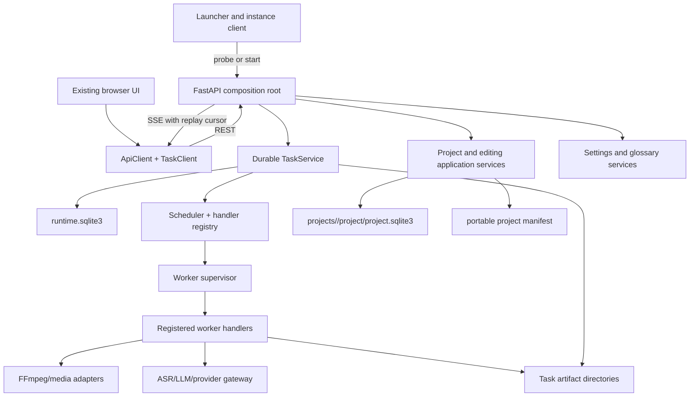
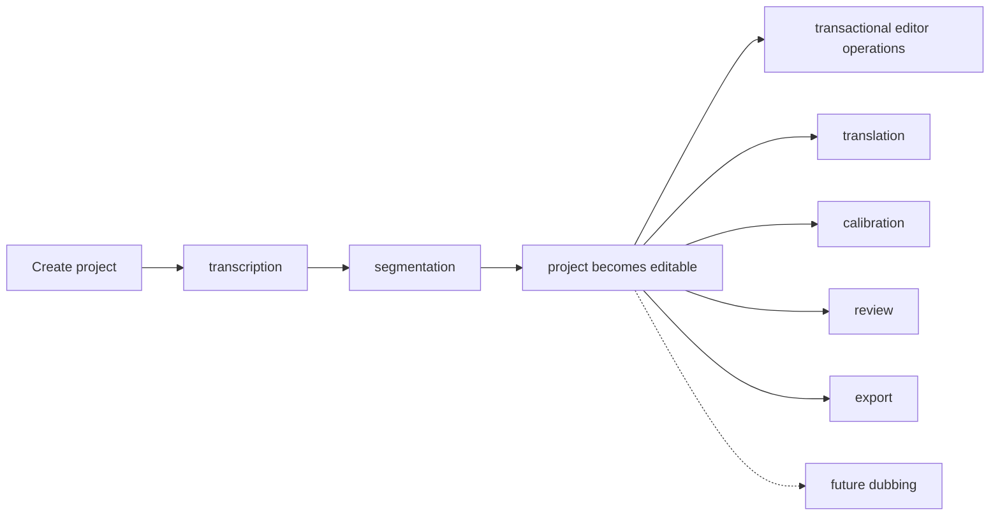

# Target architecture

## Decision

Substar will be a local modular monolith composed of a FastAPI process, a durable SQLite task runtime, supervised worker processes, per-project revision databases and the existing browser UI.

It deliberately does not introduce Redis, a distributed queue, a separate database server, microservices or a frontend framework migration. Those components solve deployment and team-scaling problems that this local application does not have.

## System topology

## Responsibility boundaries

### Launcher and instance client

- owns one launcher/instance discovery flow;
- probes an existing backend identity before starting a process;
- opens a healthy matching instance instead of replacing it;
- requests graceful restart/stop explicitly;
- owns the top-level Windows Job Object for application cleanup;
- treats the runtime record as discovery metadata, not authority.

### API process

- is the only writer to the runtime task database;
- validates HTTP contracts and maps errors consistently;
- executes short transactional project/editor commands;
- enqueues long work instead of performing it in request handlers;
- streams committed events to clients;
- finalizes verified worker output into project state.

### Task runtime

- persists tasks before dispatch;
- enforces state transitions and idempotency;
- registers task handlers by canonical task type;
- leases tasks to the current instance and heartbeats ownership;
- applies resource limits and dependency ordering;
- persists cancellation before signaling a process;
- reconciles owned tasks after restart;
- records important events and artifact metadata transactionally.

### Worker process

- receives one versioned command with frozen non-secret input;
- resolves secrets only through ephemeral supervisor injection;
- emits JSON Lines protocol messages on stdout;
- sends human/debug output to stderr/runtime log;
- writes only inside its assigned task work directory;
- never writes task lifecycle rows;
- produces candidate artifacts/results for application finalization;
- cooperatively observes cancellation and can be force-terminated as a process tree.

### Project and editor core

- keeps immutable recognition evidence separate from editable display state;
- preserves `EditorDocument`, stable IDs, provenance and revisions;
- keeps optimistic editing transactions in per-project SQLite;
- treats translations, reviews and future dubbing as revision-bound derived content;
- serializes final project writes through application services.

### Provider gateway

- owns connection pooling, timeout budgets, retry policy, cancellation and error classification;
- validates structured model responses at the boundary;
- prevents nested/multiplicative retry loops;
- records provider request metadata without persisting credentials;
- offers ASR and LLM adapter ports without exposing provider-specific fields to the UI.

## Application workflows

The user-facing subtitle-creation command creates a durable workflow plan containing registered tasks. The task graph is authoritative; workflow status is a deterministic projection for the UI.

Translation, calibration and review may be manually requested or included in an initial workflow. They always reference an immutable source revision. A completed worker result is rejected or marked superseded if its expected revision is no longer eligible for automatic application.

## Resource scheduling

The scheduler uses named resource classes instead of ad-hoc global locks:

| Resource class | Typical handlers | Default policy |
| --- | --- | --- |
| `local_gpu` | local recognition/model inference | one active task |
| `media_cpu` | FFmpeg extraction/probing/waveform preparation | bounded process count |
| `provider_io` | cloud recognition and LLM calls | configured global and per-provider limits |
| `project_write` | revision finalization | serialized per project |
| `download_io` | model downloads | bounded and deduplicated by asset/version |

Limits are configuration, not task states. A queued task may report a structured wait reason without becoming a separate state.

## Project state versus task state

Task lifecycle and product lifecycle are intentionally separate.

Possible project capabilities/status projections include:

- media attached;
- recognition evidence available;
- editable document available;
- translation available for a revision/language;
- review available for a revision;
- completed/archived.

`ready_for_edit` or the old `awaiting_edit` concept belongs to this project projection, never to the universal task state machine.

## Technology posture

- retain FastAPI and Pydantic-style contracts;
- retain SQLite and direct, explicit schema migrations;
- retain the current static frontend during runtime migration;
- prefer a single shared HTTP client/gateway; exact library is an implementation choice;
- use a small SSE adapter or standards-compliant streaming response;
- use Windows process/job primitives behind a platform adapter;
- add no new infrastructure service to run the portable application.

## Non-goals

- redesigning the UI;
- rewriting segmentation or translation algorithms before their control boundary is extracted;
- event-sourcing the subtitle document;
- persisting every human log line as a database event;
- allowing multiple API processes to share a project/runtime database;
- exposing experimental route choices to users;
- requiring network access for local project editing.
