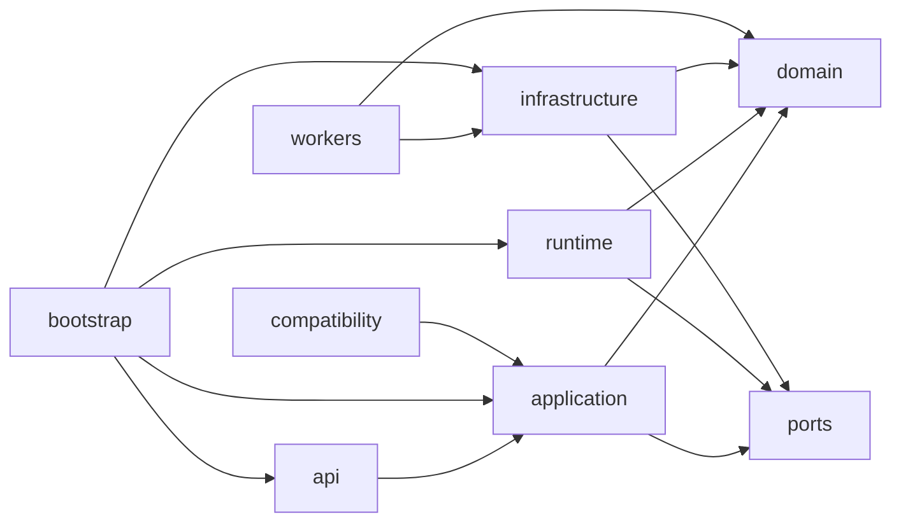

# Target module map

## Package decision

The refactor keeps the existing `substar_core` package root and introduces clear internal layers. It does not create a second permanent product package beside the old one. Historical modules are migrated into the target tree or isolated under compatibility tooling.

```text
substar_core/
├── bootstrap.py
├── instance/
│   ├── identity.py
│   ├── lifecycle.py
│   └── windows_mutex.py
├── api/
│   ├── app.py
│   ├── dependencies.py
│   ├── errors.py
│   ├── request_context.py
│   ├── routes/
│   │   ├── runtime.py
│   │   ├── events.py
│   │   ├── projects.py
│   │   ├── tasks.py
│   │   ├── editor.py
│   │   ├── settings.py
│   │   ├── glossary.py
│   │   └── compatibility.py
│   └── schemas/
│       ├── common.py
│       ├── projects.py
│       ├── tasks.py
│       └── editor.py
├── application/
│   ├── projects/
│   │   ├── service.py
│   │   └── catalog.py
│   ├── editing/
│   │   ├── service.py
│   │   └── revisions.py
│   ├── tasks/
│   │   ├── service.py
│   │   ├── commands.py
│   │   ├── finalizers.py
│   │   └── handlers/
│   │       ├── transcription.py
│   │       ├── reference_matching.py
│   │       ├── segmentation.py
│   │       ├── translation.py
│   │       ├── calibration.py
│   │       ├── review.py
│   │       ├── model_download.py
│   │       └── export.py
│   ├── workflows/
│   │   └── subtitle_creation.py
│   ├── settings/
│   │   └── service.py
│   └── glossary/
│       ├── service.py
│       └── compiler.py
├── domain/
│   ├── subtitles/
│   │   ├── document.py
│   │   ├── operations.py
│   │   ├── timing.py
│   │   ├── grouping.py
│   │   ├── presentation.py
│   │   └── validation.py
│   ├── transcription/
│   │   ├── evidence.py
│   │   └── contracts.py
│   ├── segmentation/
│   │   ├── contracts.py
│   │   ├── validation.py
│   │   ├── repair.py
│   │   └── document_builder.py
│   ├── translation/
│   │   ├── contracts.py
│   │   ├── context.py
│   │   └── presentation_mapping.py
│   ├── review/
│   │   └── contracts.py
│   ├── glossary/
│   │   └── model.py
│   └── tasks/
│       ├── model.py
│       └── transitions.py
├── runtime/
│   ├── registry.py
│   ├── scheduler.py
│   ├── supervisor.py
│   ├── cancellation.py
│   ├── events.py
│   ├── recovery.py
│   └── resources.py
├── ports/
│   ├── runtime_store.py
│   ├── project_repository.py
│   ├── artifact_store.py
│   ├── process_runner.py
│   ├── recognition_provider.py
│   ├── language_model.py
│   ├── media_tools.py
│   ├── settings_store.py
│   └── glossary_store.py
├── infrastructure/
│   ├── persistence/
│   │   ├── runtime_sqlite.py
│   │   ├── project_sqlite.py
│   │   ├── schema_migrations.py
│   │   └── project_catalog.py
│   ├── processes/
│   │   ├── runner.py
│   │   └── windows_job.py
│   ├── media/
│   │   ├── ffmpeg.py
│   │   ├── playback.py
│   │   └── waveform.py
│   ├── providers/
│   │   ├── gateway.py
│   │   ├── errors.py
│   │   ├── policy.py
│   │   ├── asr/
│   │   │   └── qwen_cloud.py
│   │   └── llm/
│   │       └── openai_compatible.py
│   ├── artifacts/
│   │   └── filesystem.py
│   ├── settings/
│   │   ├── json_store.py
│   │   └── credentials.py
│   └── glossary/
│       └── json_store.py
├── workers/
│   ├── main.py
│   ├── protocol.py
│   └── handlers/
│       ├── transcription.py
│       ├── segmentation.py
│       ├── translation.py
│       ├── calibration.py
│       ├── review.py
│       ├── model_download.py
│       └── export.py
└── compatibility/
    ├── legacy_project_reader.py
    ├── legacy_artifact_names.py
    ├── legacy_settings.py
    └── legacy_http.py
```

This is a responsibility map, not a demand that every file be created before it is needed. A module is introduced when its first production slice moves, and modules with trivial content may initially be combined without violating the dependency rules.

## Dependency rules



Forbidden dependencies:

- domain to FastAPI, SQLite, filesystem, `requests/httpx`, subprocess or environment variables;
- application services to route functions;
- runtime to provider-specific implementations;
- canonical modules to compatibility HTTP/status-file models;
- production translation/segmentation to experimental modules;
- frontend to worker steps, artifact directory names or provider payloads.

## Major module responsibilities

### `bootstrap.py`

The only composition root. It builds stores, runtime, provider gateway and application services, then creates the FastAPI app. It contains no route behavior or workflow algorithm.

### `instance/*`

Owns backend identity, mutex and graceful lifecycle. The launcher becomes a thin external client of this contract. A second launch opens the matching instance; forced replacement is an explicit recovery action.

### `api/*`

Maps HTTP/SSE to application commands, performs schema validation and canonical error mapping. Routers are small and grouped by product resource.

### `application/tasks/*`

Owns task commands and task-specific preparation/finalization. It does not supervise processes directly. Each handler registers with the runtime by canonical task type.

### `application/workflows/subtitle_creation.py`

Builds the durable dependency graph requested by the create page. It is the only place that knows the normal ordering of transcription, segmentation and optional derived tasks.

### `domain/subtitles/*`

Receives the existing editor document, operations, cue timing/grouping, presentation and validation behavior. Source-token lineage and revision semantics remain intact.

### `domain/segmentation/*`

Receives production validation, repair, cue-layout and document-building rules. Model prompting and HTTP transport do not live here.

### `domain/translation/presentation_mapping.py`

Receives the active 1:1, 1:N and N:1 cue presentation logic currently coupled to historical translation/debug modules.

### `runtime/*`

Implements the universal state machine, scheduler, leases, cancellation, events, resource claims and startup reconciliation. It does not know how segmentation or translation works.

### `infrastructure/providers/*`

Implements all cloud/local provider calls through one gateway policy. Retry, timeout and error categories live here once.

### `workers/*`

Provides one stable worker executable and registered computation handlers. Historical `run_*` scripts become compatibility/developer entry points that call this executable or are retired.

### `compatibility/*`

Is the only canonical location allowed to recognize old project directories, artifact keys, settings names and HTTP shapes. Compatibility code may depend on application commands; canonical code must not depend on compatibility representations.

## Frontend target modules

Existing HTML/CSS and focused editor modules remain. New/refactored JavaScript boundaries:

```text
web/
├── api_client.js
├── task_client.js
├── project_repository.js
├── split_controller.js
├── settings_controller.js
├── glossary_controller.js
├── editor/
│   ├── session.js
│   ├── playback_coordinator.js
│   ├── renderer.js
│   ├── document_store.js
│   ├── operation_queue.js
│   ├── cue_list_view.js
│   ├── timeline.js
│   └── waveform_cache.js
└── compatibility/
    └── response_adapters.js
```

No React/Vue migration is part of the backend refactor. TypeScript may be adopted for new contracts after packaging impact is proven, but is not required to implement the frozen architecture.

## Existing-code landing map

| Existing code | Target home |
| --- | --- |
| `domain/editor_document.py` | `domain/subtitles/document.py` |
| `document_operations_v2.py` | `domain/subtitles/operations.py` |
| `storage/project_store.py` | `infrastructure/persistence/project_sqlite.py` |
| `editor/application/*` | `application/editing/*` |
| `pipeline.py` | transcription handler plus media/provider adapters |
| `contracts/split_result_v2.py` | `domain/segmentation/document_builder.py` plus compatibility schema reader |
| active segmentation worker | `workers/handlers/segmentation.py` |
| `translation_t1mix.py` | translation worker plus `domain/translation/presentation_mapping.py` |
| `translation_service_v2.py` | replaced by `application/tasks` and `runtime` |
| editor AI route functions | calibration/review task handlers and workers |
| `model_assets.py` download registry | model-download handler; catalog remains infrastructure/application data |
| `artifacts.py` | `infrastructure/artifacts/filesystem.py` |
| `runtime_instance.py` | `instance/*` |
| old routers/status files | compatibility adapters/readers |

## Size discipline

The target is a few dozen focused modules, not hundreds of ceremonial classes. A new interface is justified only for an external boundary, a durable authority, an independently tested domain policy or a replaceable task handler.
