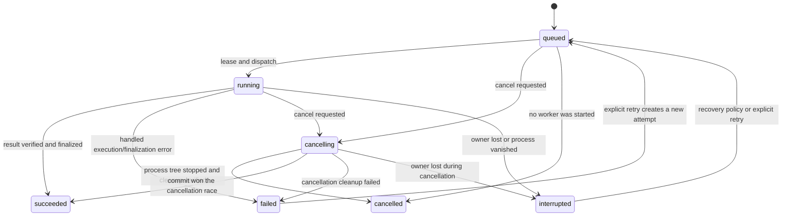

# Durable task runtime contract

## Scope

Every operation that can outlive a normal HTTP request, requires cancellation, owns a child process, waits for a provider, downloads a large asset or needs restart recovery is a durable task.

Initial registered task types:

| Task type | Purpose |
| --- | --- |
| `transcription` | media preparation, recognition submission/polling and evidence materialization |
| `reference_matching` | align reference manuscript text to immutable recognition timing evidence |
| `segmentation` | semantic grouping, cue layout, validation and editor-document candidate generation |
| `translation` | contextual translation and presentation mapping for one source revision/language |
| `calibration` | constrained punctuation/case correction for one revision |
| `review` | non-mutating issue review for one revision |
| `model_download` | acquire and verify a versioned local model asset |
| `export` | generate requested source/target/bilingual deliverables |
| `dubbing` | reserved extension point; not implemented during the core refactor |

Editor operations, project reads, settings updates and small glossary changes remain synchronous commands.

## State machine

Canonical task states:

```text
queued
running
succeeded
failed
cancelling
cancelled
interrupted
```



Rules:

- `succeeded` and `cancelled` are terminal for the task identity;
- retrying `failed` or `interrupted` increments `attempt` and preserves history;
- repeating the user operation after cancellation creates or resolves a new idempotent task;
- progress is `0.0..1.0` and monotonic within one attempt;
- a new attempt may restart progress at zero;
- cancellation is a persisted request, not a Boolean held only in memory;
- success is recorded only after output validation and required domain finalization commit;
- process exit alone never proves success.

## Runtime tables

The implementation may tune columns/indexes, but these logical records are frozen.

### `tasks`

Current task projection:

```text
task_id
project_id?                 nullable for global tasks such as model downloads
parent_task_id?             workflow/task relationship
task_type
state
attempt
progress
progress_message?
wait_reason?
input_schema
input_json                  non-secret frozen input
idempotency_key?
expected_revision_id?
created_at
updated_at
started_at?
finished_at?
cancel_requested_at?
owner_instance_id?
lease_expires_at?
result_json?
error_json?
row_version
```

### `task_attempts`

Immutable execution history:

```text
task_id + attempt
worker_id?
worker_pid?
started_at
heartbeat_at?
finished_at?
exit_code?
terminal_reason?
work_directory
stdout_log
stderr_log
error_json?
```

### `task_dependencies`

Edges in the workflow graph:

```text
task_id
depends_on_task_id
condition                   initially: succeeded
```

### `task_events`

The durable event/outbox log:

```text
event_id                    globally increasing replay cursor
task_id?
project_id?
attempt?
event_type
occurred_at
payload_json
```

State changes and their event rows are committed in one SQLite transaction. SSE publishes only committed rows.

### `task_artifacts`

Registered outputs:

```text
artifact_id
task_id
project_id?
attempt
artifact_type
schema_version?
relative_path
sha256
byte_size
created_at
metadata_json?
```

Artifact identity is attempt-scoped: `(task_id, attempt, relative_path)` is
unique. Retry keeps prior-attempt evidence and may register the same relative
path for the new attempt; success validation reads only the current attempt.

Artifact paths are project/task-relative. Absolute host paths and credentials do not enter public task payloads.

## Handler contract

Each task type registers one handler with these application responsibilities:

```text
validate_input(payload)
prepare(task, project_snapshot) -> WorkerCommand | InlineFinalization
resource_claims(task) -> claims
handle_worker_event(message)
validate_result(result, artifacts)
finalize(result, expected_revision) -> domain result
reconcile(task, attempt, filesystem/process state)
```

Handlers do not define custom lifecycle states. Domain-specific progress is carried as a canonical `step` and message inside progress events.

Example transcription steps:

```text
media_probe
audio_extract
recognition_submit
recognition_wait
recognition_download
evidence_validate
evidence_materialize
```

Example segmentation steps:

```text
input_prepare
block_plan
semantic_grouping
cue_layout
validation
repair
document_build
project_finalize
```

These names are UI-safe business concepts and replace experiment-era stages.

## Leasing and recovery

- The API instance has a stable `instance_id` for its process lifetime.
- Dispatch atomically sets `owner_instance_id`, lease expiry, attempt and `running` state.
- The supervisor renews leases while it owns a live task.
- On startup, expired tasks owned by a previous instance are reconciled before new dispatch.
- A missing worker or unprovable finalization changes the task to `interrupted`, never `succeeded`.
- A verified result that was produced before interruption may be finalized idempotently during reconciliation.
- Finalizers use result/artifact checksums and expected project revision to prevent duplicate commits.
- Provider remote IDs are stored as attempt metadata so a handler can resume polling without resubmitting.

## Idempotency

HTTP clients may provide `Idempotency-Key` on task-creating commands. The runtime stores a normalized key scoped to the operation/project/task type.

Behavior:

- same key plus equivalent input returns the existing task;
- same key plus different input returns `409 idempotency_conflict`;
- finalization is independently idempotent using `task_id`, `attempt`, result checksum and expected revision;
- provider submission IDs are persisted before polling;
- retry reuses the task identity but creates a new attempt unless the handler resumes the same remote operation.

## Cancellation and process ownership

1. API transaction records `cancel_requested_at`, transitions to `cancelling` when necessary and emits `task.cancel_requested`.
2. Supervisor signals the registered cancellation channel.
3. Worker cooperatively stops provider polling/subprocesses and emits a final cancellation message.
4. After the grace timeout, supervisor terminates the task-owned process tree through the platform adapter.
5. Supervisor verifies exit and handler cleanup before committing `cancelled`.
6. Project directories are never moved or deleted merely because cancellation was requested.

Project deletion is a separate explicit operation allowed only after no active task owns the project.

## Failure model

The public error object uses stable categories:

```text
validation
configuration
authentication
not_found
conflict
provider_unavailable
provider_rate_limited
provider_timeout
media_invalid
process_failed
artifact_invalid
revision_conflict
cancel_failed
internal
```

Each error has a stable code, human message, retryable flag and structured details. Raw secrets, complete provider payloads and tracebacks are never returned to the browser. Tracebacks remain in the attempt log.

## Retention

- Current task rows are retained with the project unless explicitly pruned.
- Attempt logs and large intermediate artifacts have a configurable retention policy.
- Important transition/progress/artifact events remain replayable for a bounded window.
- Human log lines are stored in files and only selected structured notices enter `task_events`.
- Cleanup itself is explicit and cannot remove the current project revision or immutable recognition evidence.
