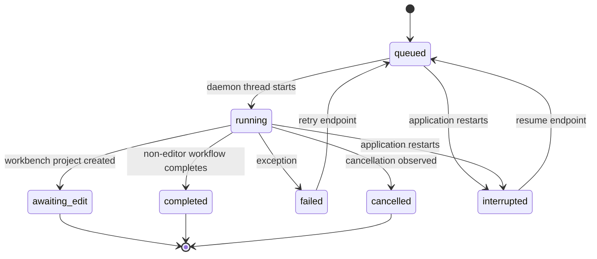
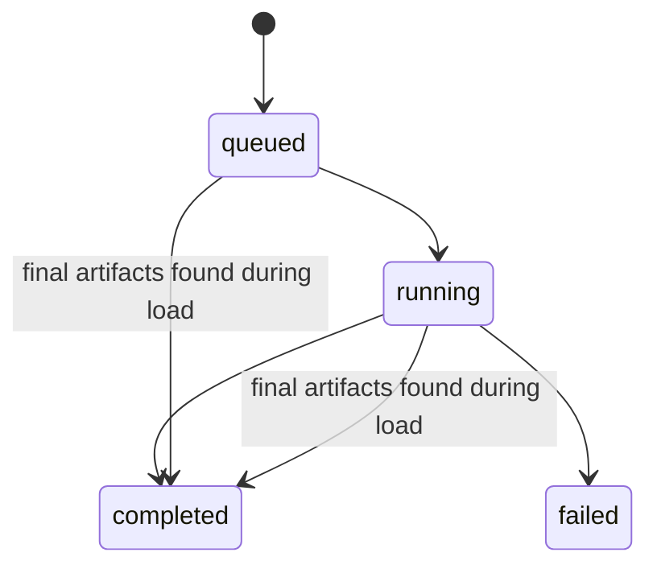

# Task and state inventory

## Summary

The application currently contains at least seven task/lifecycle mechanisms. They share neither one registry nor one status vocabulary.

| Task family | Dispatcher | Execution | Durable state | Cancel/restart behavior |
| --- | --- | --- | --- | --- |
| Main media/workbench job | `app.py` global `JOBS` | daemon thread running `_run_job`; several child processes | `<project>/job_status.json`, `stage_progress.json`, `runtime.log` | cooperative Boolean plus explicit child termination in selected loops; restart scans JSON and marks active jobs interrupted or infers completion |
| Split batch | `app.py` | request creates child jobs; batch itself has no worker | `.workbench_batches/<id>.json` | status calculated by reading child jobs; no independent cancellation |
| Translation | `translation_service_v2.py` | daemon thread plus production child process | `translation_v2/status.json` and run artifacts | no public cancellation endpoint; completion can be inferred from final artifacts; otherwise active state may remain stale |
| Calibration | `editor_api_v2.py` | synchronous API request with internal thread pool | `editor_tasks_v2/calibration.json`, audit file, committed revision | no task cancellation; client/network lifetime is coupled to request |
| Review | `editor_api_v2.py` | synchronous API request with internal thread pool | `editor_tasks_v2/review.json`, `ai_review_v2/latest.json` | no task cancellation; partial block failures recorded |
| Debug jobs | `experimental/merged_max_debug.py` | module-level `ThreadPoolExecutor` | memory plus per-task artifact/status files | separate cancel/apply protocol; production router still imports it |
| Model download | `model_assets.py` | daemon thread | module-level `_DOWNLOAD_JOBS` only | lost from API on restart; no cancel operation |
| Remote cloud ASR | `qwen_cloud_asr.py` | provider task polled by ingest worker | `qwen_cloud_state.json` | can reuse remote task ID; parent cancellation semantics are indirect |
| Editor operations | browser operation queue + synchronous API | batched HTTP transaction | SQLite revision chain; browser journal in local storage | optimistic retry and stale-revision reconciliation; this is not a long-running task |

## Main job state machine as implemented



Important details:

- `cancel_requested` is process memory and is not included in `Job.public()`.
- A cancel path moves the project directory into `.trash` and removes it from `JOBS`.
- Retry rewrites selected frozen settings and increments `attempt`.
- `_restore_persisted_jobs` scans every project directory on list/get calls.
- A queued/running job becomes `interrupted` unless completion artifacts match a hard-coded segmentation pattern.
- Main job progress combines a scalar `Job.progress` and a separate stage ledger.
- Persisted job restoration is lazy and runs on job queries, not at application startup.
- The general `/resume` path and workbench `/retry` path have different attempt/history behavior and are not equivalent recovery operations.

## Translation state machine



Translation has no `interrupted`, `cancelling` or `cancelled` state in its active service. An already-running translation is rejected based on `status.json`, so a stale active record can block a new run unless final artifacts allow completion recovery.

Creation checks and status writes are not protected by one transaction/lock, so concurrent start requests can race and launch multiple translation workers for the same project.

## Editor AI status behavior

Calibration and review write task-looking JSON states, but execute within the request handler. Their files are useful UI projections, not an independently supervised job record. There is no owner heartbeat, process ID, lease, attempt ledger or restart reconciliation.

## State-store overlap

For one ordinary project, status may be represented simultaneously in:

```text
in-memory JOBS
job_status.json
stage_progress.json
runtime.log
qwen_cloud_state.json
project_v2/project.sqlite3
editor_tasks_v2/*.json
translation_v2/status.json
translation_v2/runs/*/stage_progress.json
ai_review_v2/latest.json
```

Each file has a legitimate artifact purpose, but several are treated as authoritative lifecycle state. This is the main backend consistency problem.

## Concurrency and resource controls

| Control | Scope | Limitation |
| --- | --- | --- |
| `JOBS_LOCK` | in-memory job registry and mutations | does not serialize file projections or other task systems |
| `GPU_LOCK` | local ingest section | process-local only; deliberately released before cloud stages |
| ProjectStore transaction | one SQLite write | strong optimistic document revision boundary |
| Shared requests Session pool | one Python process | bypassed by several direct `requests` call sites |
| Per-stage thread pools | model calls within ASR/segmentation/translation/editor AI | concurrency limits are configured independently |
| Windows Job Object | launcher-owned backend process tree | lifecycle is separate from application task state |

## Recovery gaps to carry into target design

- no central task identity/handler registry;
- no uniform owner/lease/heartbeat;
- no common attempt and idempotency model;
- no common cancellation token and child-process ownership;
- no uniform transition validation;
- no common event stream for frontend replay;
- artifact completion inference is duplicated and route-specific;
- several daemon threads disappear immediately when the API process exits.
- a second launcher invocation forcefully replaces the existing backend instead of reopening it, turning instance management into an unplanned task-interruption path;
- workbench cancellation can project `cancelled` before the worker has stopped; a repeated delete may then move a directory still in use, while segmentation cancellation can surface as `failed` through a generic child-process error.
